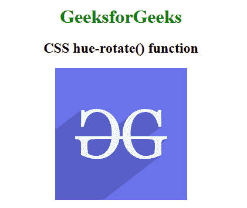

# CSS |色相-旋转()功能

> 原文:[https://www.geeksforgeeks.org/css-hue-rotate-function/](https://www.geeksforgeeks.org/css-hue-rotate-function/)

色调旋转()函数是一个内置函数，用于对图像应用滤镜来设置图像的色调旋转。

**语法:**

```html
hue-rotate( angle )
```

**参数:**该功能接受单参数**角度**，该角度保持色调旋转的角度。正的色相角会增加色相值，而负的色相角会减少色相值。

下面的例子说明了 CSS 中的色调旋转()函数:

**示例:**

```html
<!DOCTYPE html> 
<html> 

<head> 
    <title>CSS hue-rotate() Function</title> 

    <style>
        h1 {
            color:green;
        }
        body {
            text-align:center;
        }
        .hue_rotate_effect {
            filter: hue-rotate(100deg);
        }
    </style>
</head> 

<body> 
    <h1>GeeksforGeeks</h1> 

    <h2>CSS hue-rotate() function</h2>

     
</body> 

</html>                    
```

**输出:**


**支持的浏览器:**色相-旋转()功能支持的浏览器如下:

*   谷歌 Chrome
*   微软公司出品的 web 浏览器
*   火狐浏览器
*   旅行队
*   歌剧