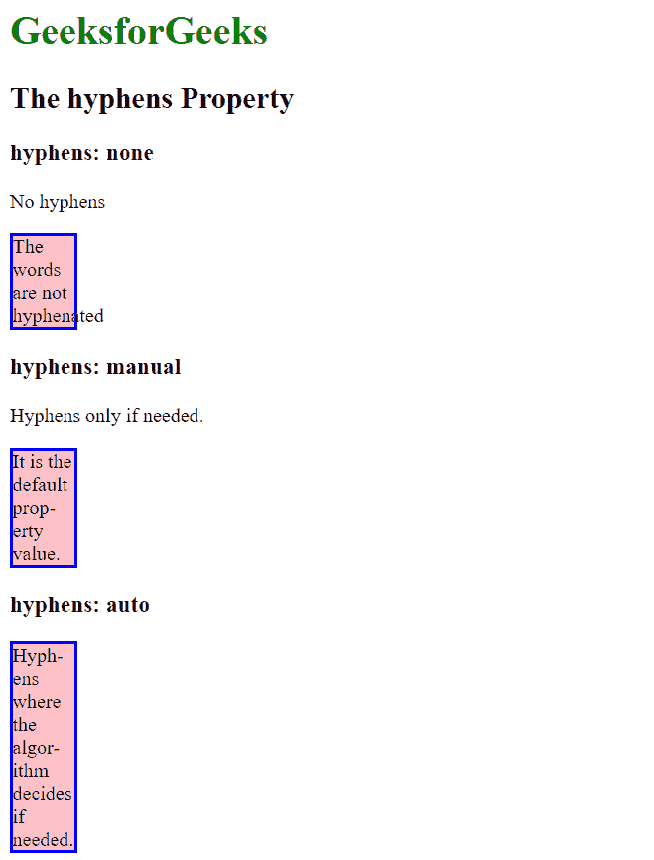
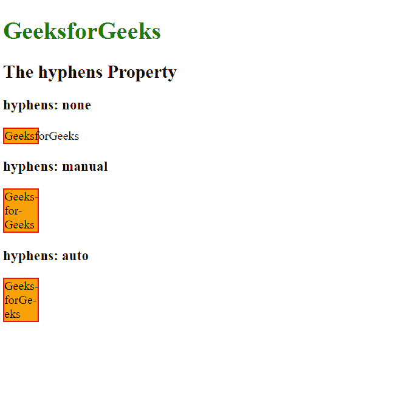

# CSS |连字符属性

> 原文:[https://www.geeksforgeeks.org/css-hyphens-property/](https://www.geeksforgeeks.org/css-hyphens-property/)

CSS 中的**连字符属性**告诉我们单词应该如何连字符，以在单词中创建软换行机会。

**语法:**

```css
 hyphens: none|manual|auto|initial|inherit;
```

**默认值:**

*   手册

**属性值:**

1.  **无:**该属性表示单词没有连字符。
2.  **手动:**这是默认属性值。这意味着只有当单词内部的字符提示断字机会时，单词才会被断字。
3.  **auto:** 该属性允许算法在适当的断字点断开单词。
4.  **初始值:**初始属性值将属性设置为默认值。
5.  **inherit:** 它从其父元素继承属性。

**示例-1:**

## 超文本标记语言

```css
<!DOCTYPE html>
<html>

<head>
    <title>
        CSS | hyphens Property
    </title>
    <style>
        body {
            text-align: left;
        }

        h1 {
            color: green;
        }

        div {
            width: 50px;
            border: 2px solid blue;
            background-color: pink;
        }

        div.a {
            <!-- none: words are not hyphend -->
            hyphens: none;
        }

        div.b {
            <!-- manual: hyphenated when
              the characters suggest -->
            hyphens: manual;
        }

        div.c {
            <!-- auto: break the words at
                 appropriate hyphenation points -->
            hyphens: auto;
        }
    </style>
</head>

<body>

    <h1>GeeksforGeeks</h1>
    <h2>The hyphens Property</h2>

    <h3>hyphens: none</h3>

<p>No hyphens</p>

    <div class="a">
       The words are not hyphenated
    </div>

    <h3>hyphens: manual</h3>

<p>Hyphens only if needed.</p>

    <div class="b">
       It is the default prop-erty value.
    </div>

    <h3>hyphens: auto</h3>
    <div class="c">
       Hyph-ens where the algor­­­­­­­­-ithm decides if needed.
    </div>

</body>

</html>
```

**输出:**



**示例-2:**

## 超文本标记语言

```css
<!DOCTYPE html>
<html>

<head>
    <title>
        CSS | hyphens Property
    </title>
    <style>
        body {
            text-align: left;
        }

        h1 {
            color: green;
        }

        div {
            width: 44px;
            border: 1.5px solid red;
            background-color: orange;
        }

        div.a {
            hyphens: none;
        }

        div.b {
            hyphens: manual;
        }

        div.c {
            hyphens: auto;
        }
    </style>
</head>

<body>

    <h1>GeeksforGeeks</h1>
    <h2>The hyphens Property</h2>

    <h3>hyphens: none</h3>
    <div class="a">GeeksforGeeks</div>

    <h3>hyphens: manual</h3>
    <div class="b">Geeks-for-Geeks</div>

    <h3>hyphens: auto</h3>
    <div class="c">Geeks-forGe-eks</div>

</body>

</html>
```

**输出:**



**支持的浏览器:**支持的浏览器 *CSS |连字符属性*如下:

*   谷歌 Chrome 55.0
*   Internet Explorer 10.0 -ms-
*   Mozilla Firefox 43.0
*   Opera 44.0
*   Safari 5.1 -webkit-