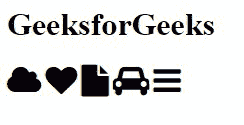
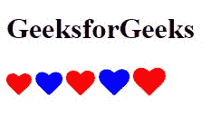
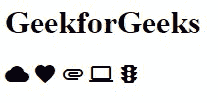
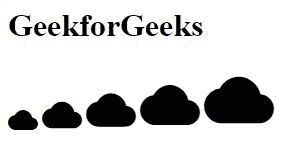
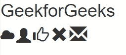

# CSS 图标

> 原文:[https://www.geeksforgeeks.org/css-icons/](https://www.geeksforgeeks.org/css-icons/)

在本文中，我们将了解如何使用图标从图标库中添加到 HTML 页面中。图标可以从可用的图标库中添加到我们的 HTML 页面中。库中的所有图标都可以使用 CSS 进行格式化。它们可以根据尺寸、颜色、阴影等进行定制。图标是一种图形表示，它传达了它所用于的特定含义&有助于相应地导航。

有 3 种类型的图标库可用，即

*   字体超赞图标
*   谷歌图标
*   引导图标

我们将从可用的图标库中包含所需的 CDN 链接，这将帮助我们使用预定义的图标类，或者我们可以使用 CSS 自定义它。

**方法:**为了使用图标，我们需要在<头>部分内添加所需的 CDN 链接。在 HTML 中添加预定义类的以下步骤:

*   将图标类的名称添加到任何内联 HTML 元素中。
*   *和元素被广泛用于添加图标。*
*   所有的图标都是可缩放的矢量图标，可以使用所需的 CSS 属性进行自定义，如大小、颜色、阴影等。

**注意:**上述所有库不需要任何下载或安装。

**方法一:字体牛逼图标**

要使用字体超赞图标，请在部分添加以下链接。

```html
<link rel="stylesheet"  
href="https://cdnjs.cloudflare.com/ajax/libs/font-awesome/4.7.0/css/font-awesome.min.css">
```

**语法:**

```html
<i class="fa fa-cloud"></i>
```

我们可以使用*字体大小*属性使其成为大尺寸图标进行显示。下面的例子说明了*字体大小*属性的使用。

**示例 1:** 在本例中，我们对每个图标类&使用了*字号*属性，其值设置为 32px。

## 超文本标记语言

```html
<!DOCTYPE html>
<html>
<head>
    <link rel="stylesheet"
          href=
"https://cdnjs.cloudflare.com/ajax/libs/font-awesome/4.7.0/css/font-awesome.min.css">
</head>

<body>
    <h1>GeeksforGeeks</h1>
        <i class="fa fa-cloud" style="font-size:32px;"></i>
        <i class="fa fa-heart" style="font-size:32px;"></i>
        <i class="fa fa-file" style="font-size:32px;"></i>
        <i class="fa fa-car" style="font-size:32px;"></i>
        <i class="fa fa-bars" style="font-size:32px;"></i>
</body>
</html>
```

**输出:**



**示例 2:** 在本例中，我们使用了“*fa-heart*类，该类具有*字号*属性&颜色属性，其值分别设置为 28px &红色、蓝色。

## 超文本标记语言

```html
<!DOCTYPE html>
<html>
<head>
    <link rel="stylesheet" href=
"https://cdnjs.cloudflare.com/ajax/libs/font-awesome/4.7.0/css/font-awesome.min.css">
</head>

<body>
    <h1>GeeksforGeeks</h1>
    <i class="fa fa-heart" style="font-size:28px;color:red;"></i>
    <i class="fa fa-heart" style="font-size:30px;color:blue;"></i>
    <i class="fa fa-heart" style="font-size:32px;color:red;"></i>
    <i class="fa fa-heart" style="font-size:34px;color:blue;"></i>
    <i class="fa fa-heart" style="font-size:36px;color:red;"></i>
</body>
</html>
```

**输出:**



**方法二:谷歌图标**

要使用谷歌图标，请在部分添加以下链接。

```html
<link rel="stylesheet" href="https://fonts.googleapis.com/icon?family=Material+Icons">
```

**语法:**

```html
<i class="material-icons">cloud</i> 
```

请参考[如何在使用 HTML 和 CSS 的网页中使用谷歌素材图标作为列表样式？](https://www.geeksforgeeks.org/how-to-use-google-material-icon-as-list-style-in-a-webpage-using-html-and-css/)文章了解如何使用预定义类的 CSS 属性。

**示例 1:** 在本例中，我们使用了带有所需图标的“*材质图标*类。

## 超文本标记语言

```html
<!DOCTYPE html>
<html>
<head>
    <link rel="stylesheet" href=
"https://fonts.googleapis.com/icon?family=Material+Icons">
</head>

<body>
    <h1>GeekforGeeks</h1>
    <i class="material-icons">cloud</i>
    <i class="material-icons">favorite</i>
    <i class="material-icons">attachment</i>
    <i class="material-icons">computer</i>
    <i class="material-icons">traffic</i>
</body>
</html>
```

**输出:**



**示例 2:** 在本例中，我们使用了云形状的“*材质图标*”类。

## 超文本标记语言

```html
<!DOCTYPE html>
<html>
<head>
    <link rel="stylesheet" href=
"https://fonts.googleapis.com/icon?family=Material+Icons">
</head>

<body>
    <h1>GeekforGeeks</h1>
    <i class="material-icons" style="font-size:30px;">cloud</i>
    <i class="material-icons" style="font-size:40px;">cloud</i>
    <i class="material-icons" style="font-size:50px;">cloud</i>
    <i class="material-icons" style="font-size:60px;">cloud</i>
    <i class="material-icons" style="font-size:70px;">cloud</i>
</body>
</html>
```

**输出:**



**方法 3:引导图标**

要使用引导图标，请在部分添加以下链接。

```html
<link rel="stylesheet"  
href="https://maxcdn.bootstrapcdn.com/bootstrap/3.3.7/css/bootstrap.min.css">
```

**语法:**

```html
<i class="glyphicon glyphicon-cloud"></i>
```

我们可以使用*字体大小*属性使其成为大尺寸图标进行显示。下面的例子说明了预定义类的*字体大小*属性的使用。

**示例 1:** 在本例中，我们对每个字形类&使用了*字号*属性，所有的值都设置为不同的数字。

## 超文本标记语言

```html
<!DOCTYPE html>
<html>
<head>
    <link rel="stylesheet" href=
"https://maxcdn.bootstrapcdn.com/bootstrap/3.3.7/css/bootstrap.min.css">
</head>

<body>
    <h1>GeekforGeeks</h1>
    <i class="glyphicon glyphicon-cloud" style="font-size:28px;"></i>
    <i class="glyphicon glyphicon-user" style="font-size:30px;"></i>
    <i class="glyphicon glyphicon-thumbs-up" style="font-size:32px;"></i>
    <i class="glyphicon glyphicon-remove" style="font-size:34px;"></i>
    <i class="glyphicon glyphicon-envelope" style="font-size:36px;"></i>
</body>
</html>
```

**输出:**



**例 2:** 在本例中，我们使用了“*大拇指向上*类的大拇指向上形状&将所有的值设置为不同的数字。

## 超文本标记语言

```html
<!DOCTYPE html>
<html>
<head>
    <link rel="stylesheet" href=
"https://maxcdn.bootstrapcdn.com/bootstrap/3.3.7/css/bootstrap.min.css">
</head>

<body>
    <h1>GeekforGeeks</h1>
    <i class="glyphicon glyphicon-thumbs-up" style="font-size:20px;"></i>
    <i class="glyphicon glyphicon-thumbs-up" style="font-size:30px;"></i>
    <i class="glyphicon glyphicon-thumbs-up" style="font-size:40px;"></i>
    <i class="glyphicon glyphicon-thumbs-up" style="font-size:50px;"></i>
    <i class="glyphicon glyphicon-thumbs-up" style="font-size:60px;"></i>
</body>
</html>
```

**输出:**

