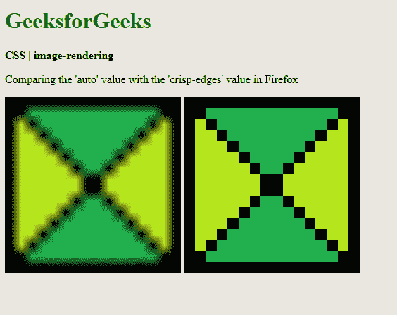
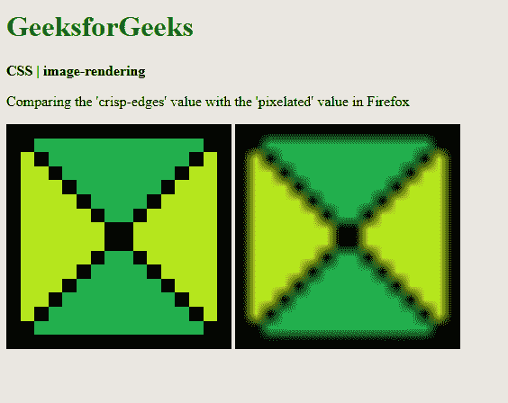
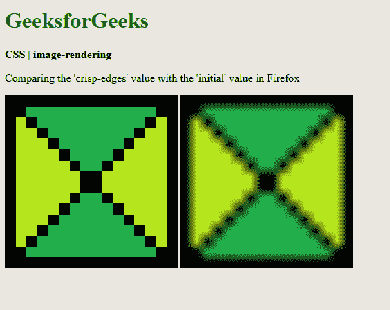

# CSS |图像渲染属性

> 原文:[https://www.geeksforgeeks.org/css-image-rendering-property/](https://www.geeksforgeeks.org/css-image-rendering-property/)

**图像渲染**属性用于设置用于图像缩放的算法类型。当用户将图像缩放到原始尺寸以上或以下时，此属性可用于修改缩放行为。

**语法:**

```css
shape-rendering: auto | crisp-edges | pixelated | initial | inherit
```

**属性值:**

*   **auto:** It is used to indicate that the scaling algorithm will be dependent on the user agent. Different browsers may have different algorithms.

    **示例:**

    ```css
    <!DOCTYPE html>
    <html>
    <head>
      <title>
        CSS | image-rendering
      </title>
      <style>
        .image-crisp {

          /* Using the crisp-edges
          value for demonstration */
          image-rendering: crisp-edges;
        }

        .image-auto {
          image-rendering: auto;
        }
      </style>
    </head>
    <body>
      <h1 style="color: green">
        GeeksforGeeks
      </h1>
      <b>
        CSS | image-rendering
      </b>
      <p>
        Comparing the 'crisp-edges'
        value with the 'auto' value
        in Firefox
      </p>
      <div class="container">
        
        
      </div>
    </body>
    </html>
    ```

    **输出:**比较清晰边缘值和自动值
    

*   **crisp-edges:** It is used to indicate that the algorithm will preserve the contrast and edges in the image. It will not smooth out the colors or blur the image due to the use of anti-aliasing. Some of the algorithms used here are nearest-neighbor and other non-smoothing scaling algorithms.

    **示例:**

    ```css
    <!DOCTYPE html>
    <html>
    <head>
      <title>
        CSS | image-rendering
      </title>
      <style>
        .image-auto {
          image-rendering: auto;
        }

        .image-crisp {
          image-rendering: crisp-edges;
        }
      </style>
    </head>

    <body>
      <h1 style="color: green">
        GeeksforGeeks
      </h1>
      <b>
        CSS | image-rendering
      </b>
      <p>
        Comparing the 'auto' value
        with the 'crisp-edges' value
        in Firefox
      </p>
      <div class="container">
        
        
      </div>
    </body>
    </html>
    ```

    **输出:**将自动值与清晰边缘值进行比较
    

*   **pixelated:** It is used to indicate that the nearest-neighbor algorithm is used on the image when it is scaled up. When the image is scaled down, the behavior is the same as the auto value.

    **示例:**

    ```css
    <!DOCTYPE html>
    <html>

    <head>
      <title>
        CSS | image-rendering
      </title>
      <style>
        .image-crisp {

          /* Using the crisp-edges
          value for demonstration */
          image-rendering: crisp-edges;
        }

        .image-pixelated {
          image-rendering: pixelated;
        }
      </style>
    </head>

    <body>
      <h1 style="color: green">
        GeeksforGeeks
      </h1>
      <b>
        CSS | image-rendering
      </b>
      <p>
        Comparing the 'crisp-edges'
        value with the 'pixelated'
        value in Firefox
      </p>
      <div class="container">
        
        
      </div>
    </body>
    </html>
    ```

    **输出:**比较清晰边缘值和像素化值
    

*   **initial:** It is used to set the property to its default value.
    **Example:**

    ```css
    <!DOCTYPE html>
    <html>
    <head>
      <title>
        CSS | image-rendering
      </title>
      <style>
        .image-crisp {
          /* Using the crisp-edges
          value for demonstration */
          image-rendering: crisp-edges;
        }

        .image-auto {
          image-rendering: initial;
        }
      </style>
    </head>
    <body>
      <h1 style="color: green">
        GeeksforGeeks
      </h1>
      <b>
        CSS | image-rendering
      </b>
      <p>
        Comparing the 'crisp-edges'
        value with the 'initial'
        value in Firefox
      </p>
      <div class="container">
        
        
      </div>
    </body>
    </html>
    ```

    **输出:**比较清晰边缘值和初始值
    

*   **inherit:** 用于设置属性从其父元素继承。

**支持的浏览器:***图像渲染*属性支持的浏览器如下:

*   铬
*   火狐浏览器
*   旅行队
*   歌剧