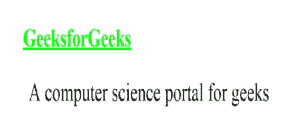

# CSS | @导入规则

> 原文:[https://www.geeksforgeeks.org/css-import-rule/](https://www.geeksforgeeks.org/css-import-rule/)

@import 规则用于将一个样式表导入到另一个样式表中。此规则还支持媒体查询，以便用户可以导入依赖于媒体的样式表。@import 规则必须在任何@charset 声明之后的文档顶部声明。

**语法:**

```
@import url|string list-of-mediaqueries;

```

**属性值:**

*   **URL |字符串:**URL 或字符串表示要导入的资源的位置。url 可以是相对的或绝对的
*   **媒体查询列表:**媒体查询列表决定链接网址中定义的 CSS 规则的应用

**示例:**考虑如下所示的两个 CSS 文件。

*   **icss.css**

    ```
    @import url("i1css.css");
    h1 {
        color: #00ff00;
    }

    ```

*   **CSS . CSS**

    ```
    h1 {
       text-decoration: underline;
       font-size:60px;
    }

    p {
       padding-left: 20px;
       font-size: 60px;
    }

    ```

链接下面 HTML 文件中的第一个 CSS 文件 icss.css，查看输出。

```
<!DOCTYPE html>
<html>
<head>
    <title>WebPage</title>
    <link href="icss.css" rel="stylesheet">
</head>

<body>
    <h1>GeeksforGeeks</h1>
    <p>A computer science portal for geeks</p>
</body>
</html>                    
```

**输出:**


**支持的浏览器:**下面列出了@import 规则支持的浏览器:

*   谷歌 Chrome
*   Internet Explorer 5.5
*   火狐浏览器
*   旅行队
*   歌剧