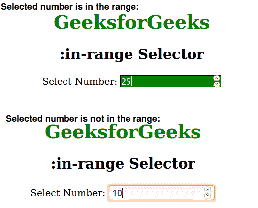

# CSS |:范围内选择器

> 原文:[https://www.geeksforgeeks.org/css-in-range-selector/](https://www.geeksforgeeks.org/css-in-range-selector/)

:范围内选择器用于选择在特定范围值内给定的所有元素。它主要用于具有类型 min/max 属性的输入元素。

**语法:**

```css
:in-range {
    // CSS property
} 

```

**示例:**

```css
<!DOCTYPE html>
<html>
    <head>
        <title>in range selector</title>
        <style>
            h1 {
            color:green;
            }
            input:in-range {
                border: 1px solid black;
                background:green;
                color:white;
            }
            body {
                text-align:center;
            }
        </style>
    </head>
    <body>
        <h1>GeeksforGeeks</h1>
        <h2>:in-range Selector</h2>
        <!-- If selected number is less then 20 and greater then
        40 then the CSS property of input elements will change. -->
        Select Number: <input type="number" min="20" max="40">
    </body>
</html>                    
```

**输出:**


**支持的浏览器:***:范围内*选择器支持的浏览器如下:

*   苹果 Safari 10.1
*   谷歌 Chrome 53.0
*   Firefox 50.0
*   Opera 40.0
*   Internet Explorer 13.0