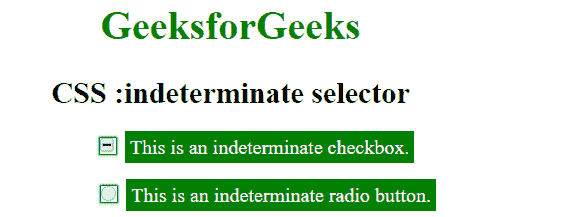
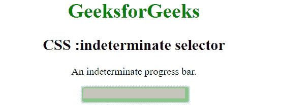

# CSS |:不确定选择器

> 原文:[https://www.geeksforgeeks.org/css-indeterminate-selector/](https://www.geeksforgeeks.org/css-indeterminate-selector/)

CSS 中的**:不确定**选择器用于选择任何处于不确定状态的表单元素，即既没有选中也没有取消选中的状态。

该选择器的目标元素是:

*   <input>不确定属性被 JavaScript 设置为真的元素
*   <input>元素，当表单中具有相同名称值的所有单选按钮未被选中时
*   <progress>处于不确定状态的元素</progress>

**示例-1:**

```css
<!DOCTYPE html>
<html>

<head>
    <title>
        CSS :indeterminate selector
    </title>
    <style>
        input:indeterminate + label {
            background: green;
            color: white;
            padding: 4px;
        }

        input:indeterminate {
            box-shadow: 0 0 1px 1px green;
        }
    </style>
</head>

<body style="text-align: center;">
    <h1 style="color:green;">
            GeeksforGeeks
        </h1>
    <h2>
            CSS :indeterminate selector
        </h2>
    <div>
        <input type="checkbox" id="checkbox">
        <label for="checkbox">This is an indeterminate checkbox.</label>
    </div>
    <br>
    <div>
        <input type="radio" id="radio" name="abc">
        <label for="radio">This is an indeterminate radio button.</label>
    </div>

    <script>
        var doc = document.getElementsByTagName("input");

        for (var i = 0; i < doc.length; i++) {
            doc[i].indeterminate = true;
        }
    </script>
</body>

</html>
```

**输出:**


**示例-2:**

```css
<!DOCTYPE html>
<html>

<head>
    <title>
        CSS :indeterminate selector
    </title>
    <style>
        progress:indeterminate {
            opacity: 0.5;
            background: lightgray;
            box-shadow: 2px 2px 4px 4px green;
        }
    </style>
</head>

<body style="text-align: center;">
    <h1 style="color:green;">
            GeeksforGeeks
        </h1>
    <h2>
            CSS :indeterminate selector
        </h2>
    <p>An indeterminate progress bar.</p>
    <progress>
</body>

</html>
```

**输出:**


**支持的浏览器:**不确定选择器支持的浏览器如下:

*   苹果 Safari
*   谷歌 Chrome 39.0
*   Firefox 51.0
*   歌剧
*   微软公司出品的 web 浏览器