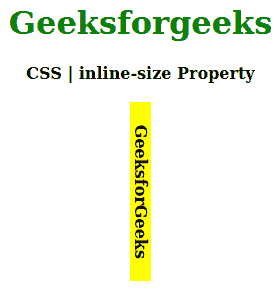
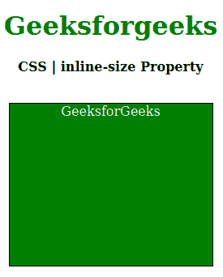

# CSS |内嵌大小属性

> 原文:[https://www.geeksforgeeks.org/css-inline-size-property/](https://www.geeksforgeeks.org/css-inline-size-property/)

CSS 中的**行内尺寸属性**用于定义元素块的水平或垂直尺寸。根据[书写模式属性](https://www.geeksforgeeks.org/css-writing-mode-property/)的值，它与宽度或高度属性一致。它会在元素文本周围留出空间。

**语法:**

```
inline-size: length | percentage | auto | inherit | initial | unset
```

**属性值:**

*   **长度:**设置 px、cm、pt 等定义的固定值。允许负值。它的默认值是 0px。
*   **百分比:**与长度相同，但为窗口大小的百分比。
*   **自动:**当希望浏览器确定内嵌尺寸时使用。
*   **初始值:**用于将块大小属性的值设置为默认值。
*   **inherit:** 当希望元素继承其父元素的块大小属性作为自己的属性时使用。
*   **取消设置:**用于取消设置默认块大小。

以下示例说明了 CSS 中的**内嵌大小属性**:

**例 1:**

```
<!DOCTYPE html>
<html>

<head>
    <title>CSS | inline-size Property</title>
    <style>
        h1 {
            color: green;
        }

        .geek {
            background-color: yellow;
            inline-size: 40%;
            writing-mode: vertical-rl;
        }
    </style>
</head>

<body>
    <center>
        <h1>Geeksforgeeks</h1>
        <b>CSS | inline-size Property</b>
        <br><br>
        <div>
            <b class="geek">GeeksforGeeks</b>
        </div>
    </center>
</body>

</html>
```

**输出:**


**例 2:**

```
<!DOCTYPE html>
<html>

<head>
    <title>CSS | inline-size Property</title>
    <style>
        h1 {
            color: green;
        }

        p.geek { 
                width: 200px; 
                height: 200px; 
                border: 1px solid black; 
                writing-mode: horizontal-tb; 
                color: white; 
                background: green; 
                inline-size: 250px;

            } 
    </style>
</head>

<body>
    <center>
        <h1>Geeksforgeeks</h1>
        <b>CSS | inline-size Property</b>
        <br><br>
        <div>
            <p class="geek">GeeksforGeeks</p>
        </div>
    </center>
</body>

</html>                    
```

**输出:**


**支持的浏览器:****内嵌大小属性**支持的浏览器如下:

*   谷歌 Chrome
*   边缘
*   Mozilla Firefox
*   歌剧
*   旅行队

**参考:**[https://developer . Mozilla . org/en-US/docs/Web/CSS/inline-size](https://developer.mozilla.org/en-US/docs/Web/CSS/inline-size)