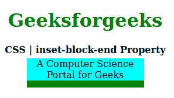
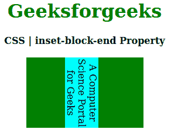

# CSS |嵌入块结束属性

> 原文:[https://www.geeksforgeeks.org/css-inset-block-end-property/](https://www.geeksforgeeks.org/css-inset-block-end-property/)

CSS 中的**嵌入块结束属性**用于定义逻辑块结束偏移量，而不是用于内联偏移量或逻辑块。此属性可以应用于任何写入模式属性。

**语法:**

```css
inset-block-end: length | percentage | auto | inherit | initial | unset;
```

**属性值:**

*   **长度:**设置 px、cm、pt 等定义的固定值。也允许负值。它的默认值是 0px。
*   **百分比:**与长度相同，但以窗口大小的百分比设置。
*   **自动:**当希望浏览器确定嵌入块结束时使用。
*   **初始值:**用于将嵌入块结束属性的值设置为默认值。
*   **inherit:** 当需要元素从其父元素继承嵌入块结束属性时使用。
*   **取消设置:**用于取消设置默认插入块结束属性。

以下示例说明了 CSS 中的**嵌入块结束属性**:

**例 1:**

```css
<!DOCTYPE html>
<html>

<head>
    <title>CSS | inset-block-end Property</title>
    <style>
        h1 {
            color: green;
        }

        div {
            background-color: green;
            width: 200px;
            height: 20px;
        }

        .one {
            position: relative;
            inset-block-end: 30px;
            background-color: cyan;
        }
    </style>
</head>

<body>
    <center>
        <h1>Geeksforgeeks</h1>
        <b>CSS | inset-block-end Property</b>
        <br><br>
        <div>
            <p class="one">
                A Computer Science Portal for Geeks
            </p>
        </div>

    </center>
</body>

</html>                    
```

**输出:**


**例 2:**

```css
<!DOCTYPE html>
<html>

<head>
    <title>CSS | inset-block-end Property</title>
    <style>
        h1 {
            color: green;
        }

        div {
            background-color: green;
            width: 200px;
            height: 120px;
        }

        .one {
            writing-mode: vertical-rl;
            position: relative;
            inset-block-end: 50px;
            background-color: cyan;
        }
    </style>
</head>

<body>
    <center>
        <h1>Geeksforgeeks</h1>
        <b>CSS | inset-block-end Property</b>
        <br><br>
        <div>
            <p class="one">
                A Computer Science Portal for Geeks
            </p>
        </div>

    </center>
</body>

</html>                    
```

**输出:**


**支持的浏览器:****内嵌块端属性**支持的浏览器如下:

*   火狐浏览器
*   谷歌 Chrome
*   边缘
*   歌剧

**参考:**[https://developer . Mozilla . org/en-US/docs/Web/CSS/inset-block-end](https://developer.mozilla.org/en-US/docs/Web/CSS/inset-block-end)