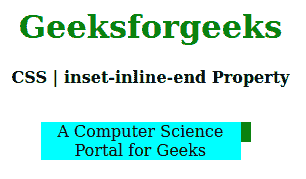
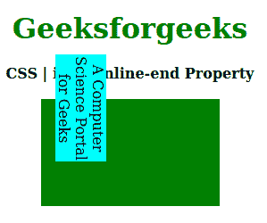

# CSS |内嵌-结束属性

> 原文:[https://www . geesforgeks . org/CSS-inset-inline-end-property/](https://www.geeksforgeeks.org/css-inset-inline-end-property/)

**内嵌结束属性**是 CSS 中的一个内置属性。它用于定义逻辑内联结束偏移量，而不是块偏移量或逻辑块。此属性可以应用于任何写入模式属性。

**语法:**

```html
inset-inline-end: length|percentage|auto|inherit|initial|unset;
```

**属性值:**

*   **长度:**设置 px、cm、pt 等定义的固定值。允许负值。其默认值为 0px。
*   **百分比:**根据窗口大小的百分比设置长度。
*   **自动:**当希望浏览器确定内嵌结束时使用。
*   **初始值:**用于将内嵌结束属性的值设置为默认值。
*   **inherit:** 当希望元素继承其父元素的 inset-inline-end 属性作为自己的属性时使用。
*   **取消设置:**用于取消设置默认内嵌结束。

以下示例说明了 CSS 中的**内嵌结束属性**:

**例 1:**

```html
<!DOCTYPE html>
<html>

<head>
    <title>CSS | inset-inline-end Property</title>
    <style>
        h1 {
            color: green;
        }

        div {
            background-color: green;
            width: 200px;
            height: 20px;
        }

        .one {
            position: relative;
            inset-inline-end: 10px;
            background-color: cyan;
        }
    </style>
</head>

<body>
    <center>
        <h1>Geeksforgeeks</h1>
        <b>CSS | inset-inline-end Property</b>
        <br>
        <br>
        <div>
            <p class="one">
                A Computer Science Portal for Geeks
            </p>
        </div>
    </center>
</body>

</html>                    
```

**输出:**


**例 2:**

```html
<!DOCTYPE html>
<html>

<head>
    <title>CSS | inset-inline-end Property</title>
    <style>
        h1 {
            color: green;
        }

        div {
            background-color: green;
            width: 200px;
            height: 120px;
        }

        .one {
            writing-mode: vertical-rl;
            position: relative;
            inset-inline-end: 50px;
            background-color: cyan;
        }
    </style>
</head>

<body>
    <center>
        <h1>Geeksforgeeks</h1>
        <b>CSS | inset-inline-end Property</b>
        <br>
        <br>
        <div>
            <p class="one">
                A Computer Science Portal for Geeks
            </p>
        </div>
    </center>
</body>

</html>                    
```

**输出:**


**支持的浏览器:****内嵌端属性**支持的浏览器如下:

*   火狐浏览器
*   边缘
*   歌剧