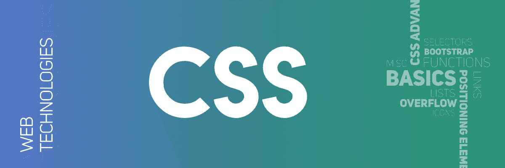
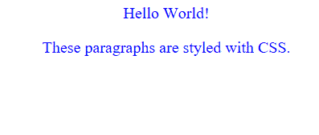

# CSS 简介

> 原文:[https://www.geeksforgeeks.org/css-introduction/](https://www.geeksforgeeks.org/css-introduction/)

**C**ascading**S**tyle**S**sheets，被亲切地称为 **CSS** ，是一种旨在简化网页呈现过程的简单设计语言。CSS 允许您将样式应用于网页。更重要的是，CSS 使您能够独立于组成每个网页的 HTML 来完成这项工作。
CSS 很容易学习和理解，但是它对 HTML 文档的呈现提供了强大的控制。



**为什么是 CSS？**

*   **CSS 省时:**可以一次写完 CSS，在多个 HTML 页面中重复使用同一个表单。
*   **易维护:**要进行全局更改，只需更改样式，所有网页中的所有元素都会自动更新。
*   **搜索引擎:** CSS 被认为是一种干净的编码技术，这意味着搜索引擎不必费力“阅读”其内容。
*   **优于 HTML 的样式:** CSS 的属性数组比 HTML 要宽得多，因此与 HTML 属性相比，您可以为 HTML 页面提供更好的外观。
*   **离线浏览:** CSS 可以借助离线缓存在本地存储 web 应用。使用这个我们可以查看离线网站。

**CSS 语法:**
CSS 由浏览器解释的样式规则组成，然后应用于文档中相应的元素。
样式规则集由选择器和声明块组成。

```html
Selector -- h1
Declaration -- {color:blue;font size:12px;} 
```

*   选择器指向您想要设置样式的 HTML 元素。
*   声明块包含一个或多个用分号分隔的声明。
*   每个声明包括一个 CSS 属性名和值，用冒号分隔。
    例如:
    –；颜色是属性，蓝色是价值。
    –；font-size 是属性，12px 是值。
*   CSS 声明总是以分号结束，声明块用大括号括起来。

**示例:**
在以下示例中，所有 p 元素将居中对齐，并带有蓝色文本颜色:

## 半铸钢ˌ钢性铸铁(Cast Semi-Steel)

```html
p {
    color: blue;
    text-align: center;
}
```



**CSS 选择器**
CSS 选择器用于根据元素名称、id、类、属性等来“查找”(或选择)HTML 元素。

**1。** **通用选择器:**通用选择器不是选择特定类型的元素，而是简单地匹配任何元素类型的名称

## 半铸钢ˌ钢性铸铁(Cast Semi-Steel)

```html
* {
   color: #000000;
}
```