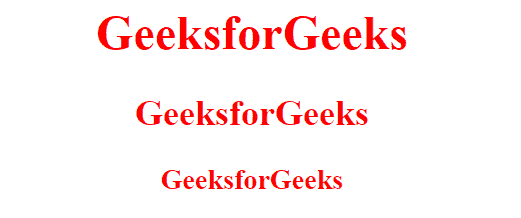
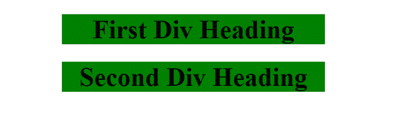

# CSS :is()选择器

> 原文:[https://www.geeksforgeeks.org/css-is-selector/](https://www.geeksforgeeks.org/css-is-selector/)

CSS 伪类是添加到选择器中的关键字，用于指定所选元素的特殊状态。

CSS **:is()** 伪类选择器以一个选择器列表为参数，选择该列表中某个选择器可以选择的任何元素。

用更少的代码更有效地选择元素是很有用的。

#### 语法:

```html
:is()
```

**示例 1:** 本示例选择容器类中的任意 h1、h2 和 h3。

## 超文本标记语言

```html
<!DOCTYPE html>
<html>

<head>
    <title>CSS :is Selector</title>
    <style>
        .container :is(h1, h2, h3) {
            color: red;
        }
    </style>
</head>

<body style="text-align: center">
    <div class="container">
        <h1>GeeksforGeeks</h1>
        <h2>GeeksforGeeks</h2>
        <h3>GeeksforGeeks</h3>
    </div>
</body>

</html>
```

#### 输出:



**示例 2:** 本示例选择 firstDiv 或 secondDiv 类中的任意 h1。

## 超文本标记语言

```html
<!DOCTYPE html>
<html>

<head>
    <title>CSS :is Selector</title>

    <style>
        :is(.firstDiv, .secondDiv) h1 {
            background: green;
        }
    </style>
</head>

<body style="text-align: center; margin: auto 30rem">
    <div class="firstDiv">
        <h1>First Div Heading</h1>
    </div>

    <div class="secondDiv">
        <h1>Second Div Heading</h1>
    </div>
</body>

</html>
```

#### 输出:



#### 浏览器支持:

*   铬
*   火狐浏览器
*   歌剧
*   边缘