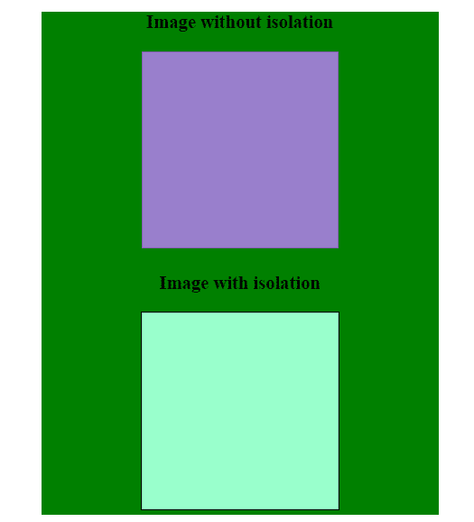

# CSS |隔离属性

> 原文:[https://www.geeksforgeeks.org/css-isolation-property/](https://www.geeksforgeeks.org/css-isolation-property/)

CSS 中的隔离属性用于定义元素是否必须创建新的堆叠内容。它通过创建不同的堆栈元素来防止元素从背景中的元素获得混合模式。
**注:**

*   隔离属性应用于父元素。
*   Internet Explorer 不支持。

**语法:**

```html
isolation: auto|isolate|initial|inherit;
```

**默认值:**

*   **自动**

**属性值:**

*   **自动:**默认使用。它会在需要时创建一个新的堆栈元素。它重置隔离并允许混合。
*   **隔离:**防止元素混合。将创建一个新的堆叠元素。
*   **初始值:**将隔离属性设置为默认值。
*   **inherit:** 此属性从其父级继承。

**示例:**

## 超文本标记语言

```html
<!DOCTYPE html>
<html>
    <head>
        <title>
            CSS | isolation Property
        </title>
        <style>
            .container {
                text-align: center;
                background-color: green;
                width: 400px;
                margin: auto;
            }

            .blend {
                width: 200px;
                height: 200px;
                mix-blend-mode: difference;
            }

            .isolate_enable {
                isolation: isolate;
            }
        </style>
    </head>

    <body>
        <div class="container">

            <h3>Image without isolation</h3>

            

            <div class="isolate_enable">
                <h3>Image with isolation</h3>
                
            </div>
        </div>
    </body>
</html>                   
```

**输出:**



**支持的浏览器:***隔离属性*支持的浏览器如下:

*   谷歌 Chrome 41.0
*   Firefox 36.0
*   旅行队
*   Opera 30.0