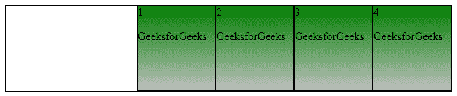
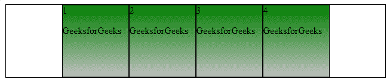
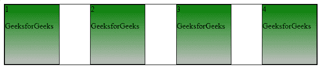
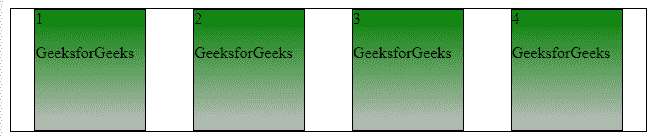
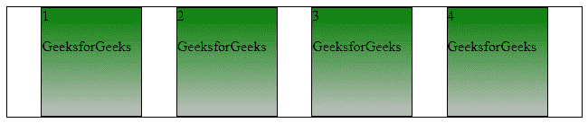
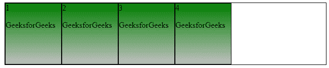
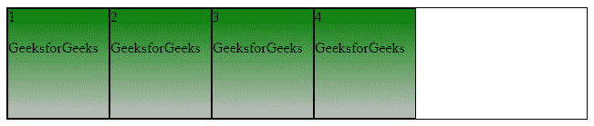

# CSS 对齐内容属性

> 原文:[https://www.geeksforgeeks.org/css-justify-content-property/](https://www.geeksforgeeks.org/css-justify-content-property/)

CSS 中的**对齐内容**属性用于描述柔性盒容器的对齐方式。它包含沿着分布在浏览器中的 flex 容器主轴的内容项目之间和周围的空间。

**注意:**该属性不能用于描述纵轴方向的物品或容器。为了垂直对齐项目，我们可以使用[对齐项目属性](https://www.geeksforgeeks.org/css-align-items-property/)

应用长度和自动边距属性后，对齐是可能的。，如果在 [Flexbox 布局](https://www.geeksforgeeks.org/advance-css-layout-with-flexbox/)中至少有一个灵活元素，并且具有 [flex-grow 属性](https://www.geeksforgeeks.org/css-flex-grow-property/)，而不是 0，那么它不会影响&的任何效果，因为不会有任何可用空间。

**语法:**

```
justify-content: flex-start|flex-end|center|space-between|
space-around|space-evenly|initial|inherit;
```

**属性值:**

**flex-start:** 是用于从容器开始对齐 flex 项目的默认值。

**语法:**

```
justify-content: flex-start;
```

**示例:**本示例阐释了**调整内容**属性，其中属性值被设置为*灵活开始*以从容器的开始对齐项目。

## 超文本标记语言

```
<!DOCTYPE html>
<html>

<head>
    <title> CSS justify-content Property </title>
    <style>
    #box {
        display: flex;
        border: 1px solid black;
        justify-content: flex-start;
    }

    #box div {
        width: 110px;
        height: 120px;
        border: 1px solid black;
        background: linear-gradient(green, silver);
    }
    </style>
</head>

<body>
    <div id="box">
        <div>1

<p>GeeksforGeeks</p>

        </div>
        <div>2

<p>GeeksforGeeks</p>

        </div>
        <div>3

<p>GeeksforGeeks</p>

        </div>
        <div>4

<p>GeeksforGeeks</p>

        </div>
    </div>
</body>

</html>
```

**输出:**


**伸缩端:**用于对齐容器末端的伸缩项。

**语法:**

```
justify-content: flex-end;
```

**示例:**本示例说明了**调整内容**属性，其中属性值设置为*伸缩结束*。

## 超文本标记语言

```
<!DOCTYPE html>
<html>

<head>
    <title> CSS justify-content Property </title>
    <style>
    #box {
        display: flex;
        border: 1px solid black;
        justify-content: flex-end;
    }

    #box div {
        width: 110px;
        height: 120px;
        border: 1px solid black;
        background: linear-gradient(green, silver);
    }
    </style>
</head>

<body>
    <div id="box">
        <div>1

<p>GeeksforGeeks</p>

        </div>
        <div>2

<p>GeeksforGeeks</p>

        </div>
        <div>3

<p>GeeksforGeeks</p>

        </div>
        <div>4

<p>GeeksforGeeks</p>

        </div>
    </div>
</body>

</html>
```

**输出:**



**居中:**它在容器的中心对齐弯曲项目。

**语法:**

```
justify-content: center;
```

**示例:**本示例说明了**调整内容**属性，其中属性值设置为*中心*。

## 超文本标记语言

```
<!DOCTYPE html>
<html>

<head>
    <title> CSS justify-content Property </title>
    <style>
    #box {
        display: flex;
        border: 1px solid black;
        justify-content: center;
    }

    #box div {
        width: 110px;
        height: 120px;
        border: 1px solid black;
        background: linear-gradient(green, silver);
    }
    </style>
</head>

<body>
    <div id="box">
        <div>1

<p>GeeksforGeeks</p>

        </div>
        <div>2

<p>GeeksforGeeks</p>

        </div>
        <div>3

<p>GeeksforGeeks</p>

        </div>
        <div>4

<p>GeeksforGeeks</p>

        </div>
    </div>
</body>

</html>
```

**输出:**



**间距:**弹性项目以均匀的间距放置，项目被推到开始，最后一个项目被推到结束。

**语法:**

```
justify-content: space-between;
```

**示例:**本示例说明了**调整内容**属性，其中属性值设置为*间距*。

## 超文本标记语言

```
<!DOCTYPE html>
<html>

<head>
    <title> CSS justify-content Property </title>
    <style>
    #box {
        display: flex;
        border: 1px solid black;
        justify-content: space-between;
    }

    #box div {
        width: 110px;
        height: 120px;
        border: 1px solid black;
        background: linear-gradient(green, silver);
    }
    </style>
</head>

<body>
    <div id="box">
        <div>1

<p>GeeksforGeeks</p>

        </div>
        <div>2

<p>GeeksforGeeks</p>

        </div>
        <div>3

<p>GeeksforGeeks</p>

        </div>
        <div>4

<p>GeeksforGeeks</p>

        </div>
    </div>
</body>

</html>
```

**输出:**



**环绕空间:**柔性物品以相等的间距 ie 放置。，前，中，后，互不相让&的旮旯。

**语法:**

```
justify-content: space-around;
```

**示例:**本示例说明了**调整内容**属性，其中属性值设置为*左右空格*。

## 超文本标记语言

```
<!DOCTYPE html>
<html>

<head>
    <title> CSS justify-content Property </title>
    <style>
    #box {
        display: flex;
        border: 1px solid black;
        justify-content: space-around;
    }

    #box div {
        width: 110px;
        height: 120px;
        border: 1px solid black;
        background: linear-gradient(green, silver);
    }
    </style>
</head>

<body>
    <div id="box">
        <div>1

<p>GeeksForGeeks</p>

        </div>
        <div>2

<p>GeeksForGeeks</p>

        </div>
        <div>3

<p>GeeksForGeeks</p>

        </div>
        <div>4

<p>GeeksForGeeks</p>

        </div>
    </div>
</body>

</html>
```

**输出:**



**间距均匀:**物品之间的间距相等，但与角的间距不同。

**语法:**

```
justify-content: space-evenly;
```

**示例:**本示例说明了**调整内容**属性，其中属性值设置为*均匀间隔*。

## 超文本标记语言

```
<!DOCTYPE html>
<html>

<head>
    <title> CSS justify-content Property </title>
    <style>
    #box {
        display: flex;
        border: 1px solid black;
        justify-content: space-evenly;
    }

    #box div {
        width: 110px;
        height: 120px;
        border: 1px solid black;
        background: linear-gradient(green, silver);
    }
    </style>
</head>

<body>
    <div id="box">
        <div>1

<p>GeeksforGeeks</p>

        </div>
        <div>2

<p>GeeksforGeeks</p>

        </div>
        <div>3

<p>GeeksforGeeks</p>

        </div>
        <div>4

<p>GeeksforGeeks</p>

        </div>
    </div>
</body>

</html>
```

**输出:**



[**初始**](https://www.geeksforgeeks.org/css-value-initial/) **:** 物品按照默认值放置。

**语法:**

```
justify-content: initial;
```

**示例:**本示例说明了**调整内容**属性，其中属性值设置为*初始*。

## 超文本标记语言

```
<!DOCTYPE html>
<html>

<head>
    <title> CSS justify-content Property </title>
    <style>
    #box {
        display: flex;
        border: 1px solid black;
        justify-content: initial;
    }

    #box div {
        width: 110px;
        height: 120px;
        border: 1px solid black;
        background: linear-gradient(green, silver);
    }
    </style>
</head>

<body>
    <div id="box">
        <div>1

<p>GeeksforGeeks</p>

        </div>
        <div>2

<p>GeeksforGeeks</p>

        </div>
        <div>3

<p>GeeksforGeeks</p>

        </div>
        <div>4

<p>GeeksforGeeks</p>

        </div>
    </div>
</body>

</html>
```

**输出:**



[**继承**](https://www.geeksforgeeks.org/css-value-inherit/) **:** 物品按照其继承的父元素值放置。

**语法:**

```
justify-content: inherit;
```

**示例:**本示例说明了**调整内容**属性，其中属性值设置为*继承*。

## 超文本标记语言

```
<!DOCTYPE html>
<html>

<head>
    <title> CSS justify-content Property </title>
    <style>
    #box {
        display: flex;
        border: 1px solid black;
        justify-content: inherit;
    }

    #box div {
        width: 110px;
        height: 120px;
        border: 1px solid black;
        background: linear-gradient(green, silver);
    }
    </style>
</head>

<body>
    <div id="box">
        <div>1

<p>GeeksforGeeks</p>

        </div>
        <div>2

<p>GeeksforGeeks</p>

        </div>
        <div>3

<p>GeeksforGeeks</p>

        </div>
        <div>4

<p>GeeksforGeeks</p>

        </div>
    </div>
</body>

</html>
```

**输出:**



**支持的浏览器:**CSS 调整内容属性支持的浏览器如下:

*   谷歌 Chrome 29.0，21.0 -webkit-
*   Internet Explorer 11.0
*   微软边缘 12.0
*   火狐 28.0， 18.0 -moz-
*   Opera 17.0
*   Safari 9.0，6.1 -webkit-