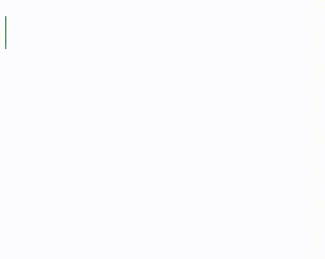
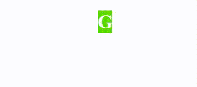

# CSS @关键帧规则

> 原文:[https://www.geeksforgeeks.org/css-keyframes-rule/](https://www.geeksforgeeks.org/css-keyframes-rule/)

CSS 中的**@关键帧规则**用于指定动画规则。动画是通过使用可变的 CSS 样式创建的。在动画期间，CSS 属性可以多次更改。

我们需要指定何时发生以百分比表示的样式变化，或者包含关键字“from”和“to”，这与 0%和 100%相同，其中 0%表示动画的开始& 100%表示动画的完成。我们可以通过使用动画属性来控制动画的外观&可以将动画绑定到选择器。关键帧忽略了！CSS 中的重要规则。

**注意:**为了最好地支持浏览器，请始终指定 0%和 100%选择器。

**语法:**

```css
@keyframes animation-name {keyframes-selector {css-styles;}}
```

**属性值:**该参数接受上面提到的和下面描述的三个值:

*   [**动画-名称**](https://www.geeksforgeeks.org/css-animation-name-property/) **:** 动画-名称是必需的，它定义了动画名称。
*   **关键帧选择器:**关键帧选择器定义动画的百分比。介于 0%到 100%之间。一个动画可以包含许多选择器。
*   **css 样式:**css 样式定义了一个或多个合法或适用的 CSS 样式属性。

**示例 1:** 本示例描述了使用@关键帧规则将动画添加到元素中。

## 超文本标记语言

```css
<!DOCTYPE html>
<html>

<head>
    <style>
    h1 {
        color: white;
        text-align: center;
    }

    div {
        background: green;
        position: relative;
        animation: gfg 10s infinite;
    }

    /* keyframe CSS style */
    @keyframes gfg {
        0% {
            top: 0px;
            width: 00px;
        }
        25% {
            top: 50px;
            background: LawnGreen;
            width: 50px;
        }
        50% {
            top: 100px;
            background: LightGreen;
            width: 100px;
        }
        75% {
            top: 150px;
            background: MediumSeaGreen;
            width: 150px;
        }
        100% {
            top: 200px;
            color: white;
            background: Green;
            width: 200px;
        }
    }
    </style>
</head>

<body>
    <div>
        <h1>GeeksforGeeks</h1>
    </div>
</body>

</html>
```

**输出:**



**示例 2:** 本示例使用！CSS 中的重要规则。

## 超文本标记语言

```css
<!DOCTYPE html>
<html>

<head>
    <style>
    h1 {
        color: white;
        text-align: center;
    }

    div {
        background: green;
        position: relative;
        animation: gfg 7s infinite;
    }

    @keyframes gfg {
        0% {
            top: 0px;
            width: 0px;
        }
        25% {
            top: 50px !important;
            background: LawnGreen;
        }
        50% {
            top: 100px !important;
            background: LightGreen;
        }
        100% {
            top: 200px !important;
            color: white;
            background: Green;
            width: 210px;
        }
    }
    </style>
</head>

<body>
    <center>
        <div>
            <h1>GeeksforGeeks</h1> 
        </div>
    </center>
</body>

</html>
```

**输出:**



**支持的浏览器:***@关键帧规则*支持的浏览器如下:

*   谷歌 Chrome 43.0，4.0 -webkit-
*   微软边缘 10.0
*   火狐 16.0， 5.0 -moz-
*   Safari 9.0，4.0 -webkit-
*   运行 30.0、15.0 -webkit、12.0 -o-