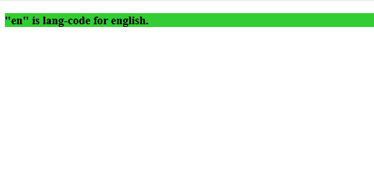
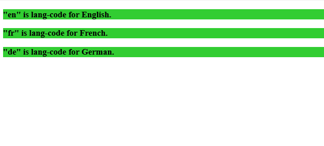

# CSS |:郎选择器

> 原文:[https://www.geeksforgeeks.org/css-lang-selector/](https://www.geeksforgeeks.org/css-lang-selector/)

**:语言选择器**用于针对基于特定值的语言属性的元素。这个选择器在语言代码的帮助下工作。

**语法:**

```css
:lang(lang-code) {
  //property
}

```

**语言代码:**

*   **en:** 代表英语。
*   **hi:** 代表印地语。
*   **fr:** 为法语。
*   **de:** 为德语
*   **it:** 代表意大利语
*   **ca:** 代表加拿大人

**示例-1:**

```css
<!DOCTYPE html>
<html>

<head>
    <style>
        h3:lang(en) {
            background: limegreen;
        }
    </style>
</head>

<body>

    <h3 lang="en">"en" is lang-code for english.</h3>

</body>

</html>
```

**输出:**


**示例-2:** 语言代码应用于根元素。

```css
<!DOCTYPE html>
<html>

<head>
    <style>
        h3:lang(en) {
            background: limegreen;
        }
    </style>
</head>

<body lang="en">

    <h3>"en" is lang-code for English.</h3>
    <h3>"fr" is lang-code for French.<h3>
<h3>"de" is lang-code for German.<h3>
</body>
</html>
```

**输出:**


**支持的浏览器:**

*   谷歌 Chrome 4.0
*   Edge 8.0
*   Firefox 2.0
*   Safari 3.1
*   歌剧 9.6