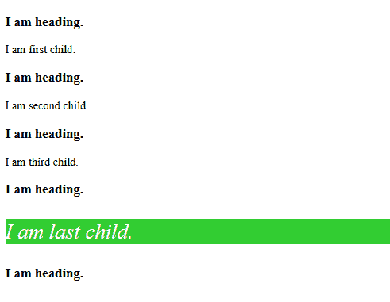

# CSS |:最后一个类型选择器

> 原文:[https://www.geeksforgeeks.org/css-last-of-type-selector/](https://www.geeksforgeeks.org/css-last-of-type-selector/)

**:最后一个类型**选择器用于定位其父元素相同类型的最后一个子元素进行造型。该选择器与“:第 n 个最后一个类型”相同。

**语法:**

```
:last-of-type {
  //property
}

```

**示例:**

```
<!DOCTYPE html>
<html>

<head>
    <style>
        p:last-of-type {
            background: limegreen;
            color: white;
            font-style: italic;
            font-size: 1.875em;
        }
    </style>
</head>

<body>
    <h3>I am heading.</h3>
    <p>I am first child.</p>
    <h3>I am heading.</h3>
    <p>I am second child.</p>
    <h3>I am heading.</h3>
    <p>I am third child.</p>
    <h3>I am heading.</h3>
    <p>I am last child.</p>
    <h3>I am heading.</h3>

</body>

</html>
```

**输出:**


**支持的浏览器:**

*   谷歌 Chrome 4.0
*   Edge 9.0
*   Firefox 3.5
*   Safari 3.2
*   歌剧 9.6