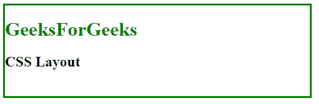
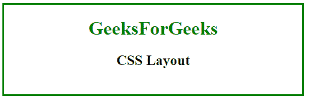
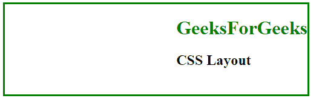
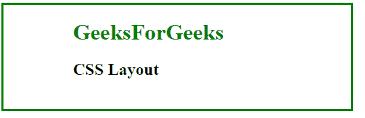
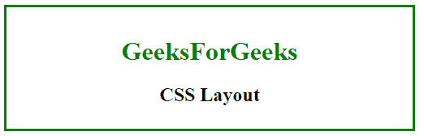
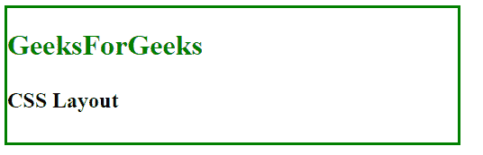
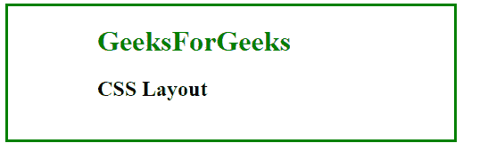
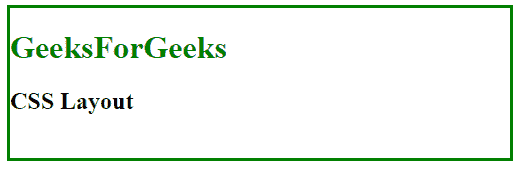
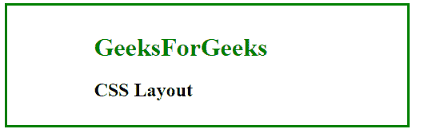

# CSS |布局–水平&垂直对齐

> 原文:[https://www . geesforgeks . org/CSS-布局-水平-垂直-对齐/](https://www.geeksforgeeks.org/css-layout-horizontal-vertical-align/)

CSS 中的布局用于控制元素在另一个元素中的流动。它设置元素在网页中的位置。元素的位置可以通过水平和垂直对齐来设置。有许多方法可以设置元素的位置，如下所示:

**使用位置属性:**使用位置属性为绝对设置左右对齐。

**语法:**

```
position: absolute;
```

**示例:**

```
<!DOCTYPE html> 
<html> 
    <head> 
        <title> 
            CSS Layout 
        </title> 

        <style>
            body{
                width: 500px;
                height: 150px;
                border: 3px solid green;
            }
            #content{
                position: absolute;
            }
        </style>
    </head>

    <body> 
        <div id="content">
            <h1 style = "color:green;" > 
                GeeksForGeeks 
            </h1> 

            <h2>CSS Layout</h2>
        </div>
    </body> 
</html>                                
```

**输出:**


**使用文本对齐属性:**使用文本对齐属性设置元素的水平对齐。文本对齐属性可以设置为左对齐、右对齐或居中。

**语法:**

```
text-align: center;
```

**示例:**

```
<!DOCTYPE html> 
<html> 
    <head> 
        <title> 
            CSS Layout 
        </title> 

        <style>
            body{
                width: 500px;
                height: 150px;
                border: 3px solid green;
            }
            #content{
                text-align: center;
            }
        </style>
    </head>

    <body> 
        <div id="content">
            <h1 style = "color:green;" > 
                GeeksForGeeks 
            </h1> 

            <h2>CSS Layout</h2>
        </div>
    </body> 
</html>                                
```

**输出:**


**使用 float 属性:**使用 float 属性设置元素的对齐方式。浮点值可以设置为左或右。

**语法:**

```
float: right;
```

**示例:**

```
<!DOCTYPE html> 
<html> 
    <head> 
        <title> 
            CSS Layout 
        </title> 

        <style>
            body{
                width: 500px;
                height: 150px;
                border: 3px solid green;
            }
            #content{
                float: right;
            }
        </style>
    </head>

    <body> 
        <div id="content">
            <h1 style = "color:green;" > 
                GeeksForGeeks 
            </h1> 

            <h2>CSS Layout</h2>
        </div>
    </body> 
</html>                    
```

**输出:**


**水平使用填充属性:**填充属性用于通过使用左右填充将元素对齐设置为水平。

**语法:**

```
padding: 0 100px;
```

**示例:**

```
<!DOCTYPE html> 
<html> 
    <head> 
        <title> 
            CSS Layout 
        </title>

        <style>
            body{
                width: 500px;
                height: 150px;
                border: 3px solid green;
            }
            #content{
                padding: 0 100px;
            }
        </style>
    </head>

    <body> 
        <div id="content">
            <h1 style = "color:green;" > 
                GeeksForGeeks 
            </h1> 

            <h2>CSS Layout</h2>
        </div>
    </body> 
</html>                    
```

**输出:**


**垂直使用填充属性:**填充属性用于通过使用顶部和底部填充将元素对齐设置为垂直。

**语法:**

```
padding: 15px 0;
```

**示例:**

```
<!DOCTYPE html> 
<html> 
    <head> 
        <title> 
            CSS Layout 
        </title> 

        <style>
            body{
                width: 500px;
                height: 150px;
                border: 3px solid green;
            }
            #content{
                padding: 15px 0;
                text-align: center;
            }
        </style>
    </head>

    <body> 
        <div id="content">
            <h1 style = "color:green;" > 
                GeeksForGeeks 
            </h1> 

            <h2>CSS Layout</h2>
        </div>
    </body> 
</html>                    
```

**输出:**


**行高属性:**行高用于垂直设置对齐方式。

**语法:**

```
line-height: 40px;
```

**示例:**

```
<!DOCTYPE html> 
<html> 
    <head> 
        <title> 
            CSS Layout 
        </title> 

        <style>
            body {
                width: 500px;
                height: 150px;
                border: 3px solid green;
            }
            #content {
                line-height: 40px;
            }
        </style>
    </head>

    <body> 
        <div id="content">
            <h1 style = "color:green;" > 
                GeeksForGeeks 
            </h1> 

            <h2>CSS Layout</h2>
        </div>
    </body> 
</html>                    
```

**输出:**


**使用边距属性:**边距属性用于设置自动水平对齐块元素。

**语法:**

```
margin: auto;
```

**示例:**

```
<!DOCTYPE html> 
<html> 
    <head> 
        <title> 
            CSS Layout 
        </title> 

        <style>
            body {
                width: 500px;
                height: 150px;
                border: 3px solid green;
            }
            #content {
                margin: auto;
                width: 300px; 
                height: 100px;
            }
        </style>
    <head>

    <body> 
        <div id="content">
            <h1 style = "color:green;" > 
                GeeksForGeeks 
            </h1> 

            <h2>CSS Layout</h2>
        </div>
    </body> 
</html>                    
```

**输出:**


**使用 Clearfix:** 如果任何元素比它的父元素高，并且它是浮动的，那么它将溢出到它的容器之外。溢出被设置为自动修复这个问题。

**语法:**

```
overflow: auto;
```

**示例:**

```
<!DOCTYPE html> 
<html> 
    <head> 
        <title> 
            CSS Layout 
        </title> 

        <style>
            body {
                width: 500px;
                height: 150px;
                border: 3px solid green;
            }
            #content {
                overflow: auto; 
            }
        </style>
    </head>

    <body> 
        <div id="content">
            <h1 style = "color:green;" > 
                GeeksForGeeks 
            </h1> 

            <h2>CSS Layout</h2>
        </div>
    </body> 
</html>                    
```

**输出:**


**使用变换和定位:**变换属性用于将元素相对于其父元素以及位置变换为绝对。

**语法:**

```
position: absolute;
transform: translate(X%, Y%);
```

**示例:**

```
<!DOCTYPE html> 
<html> 
    <head> 
        <title> 
            CSS Layout 
        </title> 

        <style>
            body {
                width: 500px;
                height: 150px;
                border: 3px solid green;
            }
            #content {
                position: absolute;
                transform: translate(50%, 10%); 
            }
        </style>
    </head>

    <body> 
        <div id="content">
            <h1 style = "color:green;" > 
                GeeksForGeeks 
            </h1> 

            <h2>CSS Layout</h2>
        </div>
    </body> 
</html>                    
```

**输出:**
