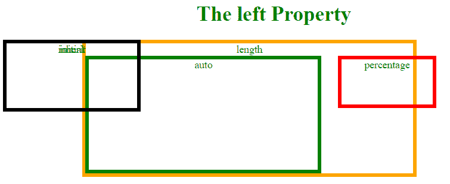
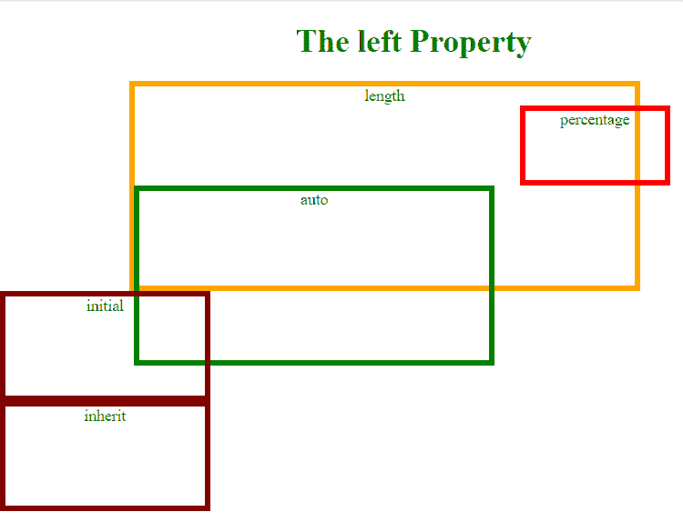

# CSS |左侧属性

> 原文:[https://www.geeksforgeeks.org/css-left-property/](https://www.geeksforgeeks.org/css-left-property/)

CSS 中的 left 属性用于指定定位元素的水平位置。它对未定位的元素没有影响。

**注:**

*   如果 position 属性是绝对的或固定的，left 属性指定元素左边缘与其包含块的左边缘之间的距离。
*   如果 position 属性是相对的，left 属性指定元素左边缘从其正常位置向右移动的距离。
*   如果 position 属性是粘性的，那么当元素位于视口内部时，left 属性的行为就像它的位置是相对的，而当元素位于外部时，它的位置是固定的。
*   如果 position 属性是静态的，那么 left 属性没有任何作用。
*   如果定义了左属性和右属性，当容器从左到右时，左值优先，当容器从右到左时，右值优先。

**语法:**

```
left: length|percentage|auto|initial|inherit;
```

**属性值:**

*   **长度:**用于指定左侧属性的长度。它接受正值和负值。
*   **百分比:**以百分比指定包含块的宽度。
*   **自动:**用于将左侧属性设置为默认值。
*   **初始值:**用于将左侧属性指定为默认值。
*   **继承:**从其父级设置左侧属性。

**示例 1 :** 本示例将位置属性描述为绝对。

```
<!DOCTYPE html>
<html>
    <head>
        <title>
            CSS left Property
        </title>
        <style>
            body {
                color: Green;
                text-align: center;
            }
            .GFG1 {
                position: absolute;
                left: 129px;
                width: 500px;
                height: 200px;
                border: 5px solid orange;
            }
            .GFG2 {
                position: absolute;
                left: 77%;
                width: 140px;
                height: 70px;
                border: 5px solid red;
            } 
            .GFG3 {
                position: absolute;
                left: auto;
                width: 350px;
                height: 170px;
                border: 5px solid green;
            }

            .GFG4 {
                position: absolute;
                left: initial;
                width: 200px;
                height: 100px;
                border: 5px solid maroon;
            }

            .GFG5 {
                position: absolute;
                left: inherit;
                width: 200px;
                height: 100px;
                border: 5px solid black;
            } 
        </style>
    </head>

    <body>
        <h1>The left Property</h1>

        <div class = "GFG1">length
            <div class="GFG2">percentage</div>
            <div class="GFG3">auto</div>
        </div>
        <div class = "GFG4">initial</div>
        <div class = "GFG5">inherit</div>
    </body>
</html>                    
```

**输出:**


**注意:***初始*和*的容器继承*重叠，因为有相似的尺寸和值默认值。

**示例 2:** 本示例将位置属性描述为相对。

```
<!DOCTYPE html>
<html>
    <head>
        <title>
            CSS left Property
        </title>

        <style>
            body {
                color: Green;
                text-align: center;
            }
            .GFG1 {
                position: relative;
                left: 129px;
                width: 500px;
                height: 200px;
                border: 5px solid orange;
            }

            .GFG2 {
                position: relative;
                left: 77%;
                width: 140px;
                height: 70px;
                border: 5px solid red;
            } 

            .GFG3 {
                position: relative;
                left: auto;
                width: 350px;
                height: 170px;
                border: 5px solid green;
            }

            .GFG4 {
                position: relative;
                left: initial;
                width: 200px;
                height: 100px;
                border: 5px solid maroon;
            }

            div.e {
                position: relative;
                left: inherit;
                width: 200px;
                height: 100px;
                border: 5px solid blue;
            } 
        </style>
    </head>

    <body>
        <h1>The left Property</h1>

        <div class="GFG1">length
            <div class="GFG2">percentage</div>
            <div class="GFG3">auto</div>
        </div>
        <div class="GFG4">initial</div>
        <div class="GFG4">inherit</div>
    </body>
</html>                    
```

**输出:**


**支持的浏览器:**左属性支持的浏览器如下:

*   谷歌 Chrome 1.0
*   Internet Explorer 5.5
*   Firefox 1.0
*   Safari 1.0
*   Opera 5.0