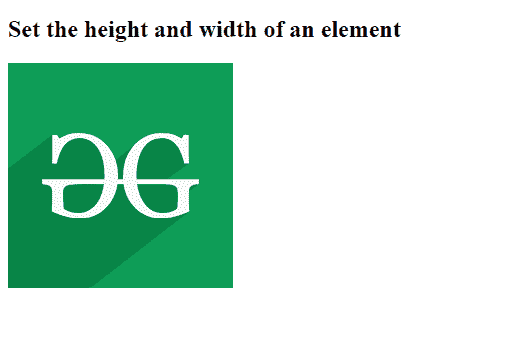
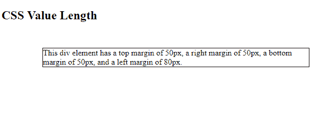

# CSS |长度数据类型

> 原文:[https://www.geeksforgeeks.org/css-length-data-type/](https://www.geeksforgeeks.org/css-length-data-type/)

长度是距离的度量，后跟长度单位。数字和单位之间没有空格。它可以是积极的，也可以是消极的。长度单位在 0 后可选。有两种类型的长度单位，绝对的和相对的。长度用于许多 CSS 属性，如填充、边框宽度、字体大小、文本阴影、宽度、高度和边距。

**语法:**

```html
<length>
```

它以数字后跟长度单位作为参数。

**注:**数字与其单位之间不应有空格。

**示例 1:** 以下示例演示了使用 CSS 将长度用作值。

## 超文本标记语言

```html
<!DOCTYPE html>
<html>

<head>
    <style>
        div {
            height: 200px;
            width: 150px;
        }
    </style>

    <title>
        CSS | Length Data Type
    </title>
</head>

<body>
    <h2>
        Set the height and
        width of an element
    </h2>

    <div>
        
    </div>
</body>

</html>
```

**输出:**



**示例 2:** 以下示例演示了长度作为 div 元素边距的值。

## 超文本标记语言

```html
<!DOCTYPE html>
<html>

<head>
    <style>
        div {
            border: 1px solid black;
            margin-top: 50px;
            margin-bottom: 50px;
            margin-right: 50px;
            margin-left: 80px;
            background-color: lightblue;
        }
    </style>
</head>

<body>

    <h2>CSS Value | Length</h2>

    <div>
        This div element has a top
        margin of 50px, a right
        margin of 50px, a bottom
        margin of 50px, and a left
        margin of 80px.
    </div>
</body>

</html>
```

**输出:**



**支持的浏览器:**

*   谷歌 Chrome
*   微软公司出品的 web 浏览器
*   火狐浏览器
*   歌剧
*   旅行队