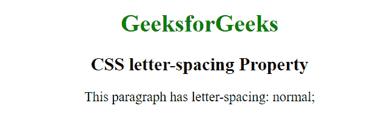
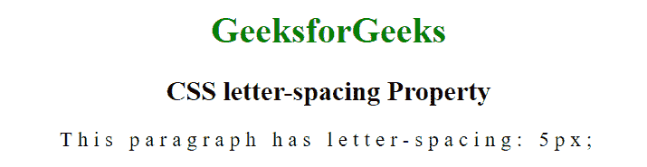

# CSS |字母间距属性

> 原文:[https://www.geeksforgeeks.org/css-letter-spacing-property/](https://www.geeksforgeeks.org/css-letter-spacing-property/)

CSS 中的**字母间距**属性用于设置文本字符之间的间距行为，即增加或减少文本中字符之间的间距。

**语法:**

```css
letter-spacing: normal|length|initial|inherit;
```

**属性值**:

*   **正常:**当前字体的正常字母间距，即字符之间没有多余的间距。这是默认值。
    **语法:**

```css
letter-spacing: normal;
```

**示例:**

```css
<!DOCTYPE html>
<html>
    <head>
        <title>CSS letter-spacing Property</title>
        <style>
            p {
              letter-spacing: normal;
            }
        </style>
    </head>
    <body style = "text-align: center;">
        <h1 style = "color:green;">
            GeeksforGeeks
        </h1>

        <h2>
            CSS letter-spacing Property
        </h2>

        <p>
            This paragraph has letter-spacing: normal;
        </p>
    </body>
</html>
```

**输出:**


*   **length:** This mode specifies extra inter-character space in addition to the default space between characters. Negative values are also allowed.

    **语法:**

    ```css
    letter-spacing: length;
    ```

    **示例:**

    ```css
    <!DOCTYPE html>
    <html>
        <head>
            <title>CSS letter-spacing Property</title>
            <style>
                p {
                  letter-spacing: 5px;

                }
            </style>
        </head>
        <body style = "text-align: center;">
            <h1 style = "color:green;">
                GeeksforGeeks
            </h1>

            <h2>
                CSS letter-spacing Property
            </h2>

            <p>
                This paragraph has letter-spacing: 5px;
            </p>
        </body>
    </html>
    ```

    **输出:**
    

    *   **initial:** This mode sets this property to its default value.
    **Syntax:**

    ```css
    letter-spacing: initial;
    ```

    **支持的浏览器:**字母间距属性支持的浏览器如下:

    *   谷歌 Chrome 1.0
    *   Internet Explorer 4.0
    *   Firefox 1.0
    *   歌剧 3.5
    *   苹果 Safari 1.0