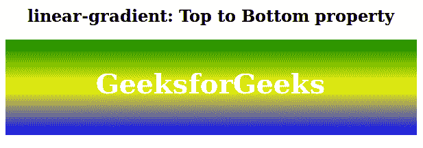
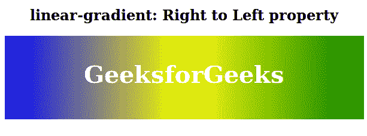

# CSS |线性-渐变()函数

> 原文:[https://www.geeksforgeeks.org/css-linear-gradient-function/](https://www.geeksforgeeks.org/css-linear-gradient-function/)

线性渐变()函数是 CSS 中的一个内置函数，用于将线性渐变设置为背景图像。
**语法:**

```html
background-image: linear-gradient( direction, color1, color2, ... )
```

**参数:**该功能接受一个方向参数和多个颜色参数，如下所示:

*   **方向:**此参数用于定义起点和方向以及渐变效果。
*   **color1、color2、…:** 此参数用于保存颜色值及其可选的停止位置。

以下示例说明 CSS 中的线性渐变()函数:
**示例 1:**

## 超文本标记语言

```html
<!DOCTYPE html>
<html>
    <head>
        <title>linear-gradient function</title>
        <style>
        .gradient {
            height: 100px;
            background-image: linear-gradient(green, yellow, blue);
            Text-align:center;
            padding-top:40px;
            font-size:40px;
            color:white;
            font-weight:bold;
        }
        h2 {
            text-align:center;
        }
        </style>
    </head>
    <body>
        <h2>linear-gradient: Top to Bottom property</h1>
        <div class="gradient">GeeksforGeeks</div>
    </body>
</html>
```

**输出:**



**例 2:**

## 超文本标记语言

```html
<!DOCTYPE html>
<html>
    <head>
        <title>linear-gradient function</title>
        <style>
        .gradient {
            height: 100px;
            background-image: linear-gradient(to left, green, yellow, blue);
            Text-align:center;
            padding-top:40px;
            font-size:40px;
            color:white;
            font-weight:bold;
        }
        h2 {
            text-align:center;
        }
        </style>
    </head>
    <body>
        <h2>linear-gradient: Right to Left property</h1>
        <div class="gradient">GeeksforGeeks</div>
    </body>
</html>
```

**输出:**



**支持的浏览器:**

*   谷歌 Chrome
*   微软公司出品的 web 浏览器
*   火狐浏览器
*   歌剧
*   狩猎