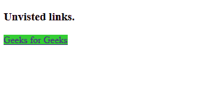

# CSS |:链接选择器

> 原文:[https://www.geeksforgeeks.org/css-link-selector/](https://www.geeksforgeeks.org/css-link-selector/)

:链接用于定位未访问的链接，而不是已经访问过的链接。对于访问时的样式使用“[:访问时的](https://www.geeksforgeeks.org/css-visited-selector/)”，对于点击时的样式使用“[:活动时的](https://www.geeksforgeeks.org/css-active-selector/)”，对于链接时的样式移动鼠标使用:“悬停”。
**语法:**

```
:link {
  //property
}
```

**示例:**

## 超文本标记语言

```
<!DOCTYPE html>
<html>

<head>
    <style>
        a:link {
            background-color: limegreen;
        }
    </style>
</head>

<body>
    <h3>Unvisited links.</h3>
    <a href="https://ide.geeksforgeeks.org/">Geeks for Geeks</a>
</body>

</html>
```

**输出:**



**支持的浏览器:**

*   谷歌 Chrome 4.0
*   Edge 7.0
*   Firefox 2.0
*   Safari 3.1
*   歌剧 9.6