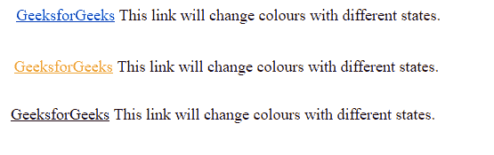

# CSS |链接

> 原文:[https://www.geeksforgeeks.org/css-links/](https://www.geeksforgeeks.org/css-links/)

[链接](https://www.geeksforgeeks.org/html-links/)是从一个网页到另一个网页的连接。属性可以用来以各种不同的方式设置链接的样式。

**链接的状态:**在讨论 CSS 属性之前，了解链接的状态很重要。链接可以存在于不同的状态，并且它们可以使用伪类进行样式化。
下面给出了四种状态的链接:

*   **a:链接** = >这是一个正常的、未访问的链接。
*   **a:已访问** = >这是用户至少访问过一次的链接
*   **a:悬停** = >这是鼠标悬停在上面的链接
*   **a:活跃** = >这是一个刚刚点击的链接。

**语法:**

```css
a:link {
    color:color_name;
}

```

color_name 可以以任何格式给出，如颜色名称(绿色)、十六进制值(#5570f0)或 RGB 值 rgb(25，255，2)。还有另一种状态“a:focus ”,当用户使用 tab 键浏览链接时，该状态用于聚焦。

**链接默认值:**

*   默认情况下，创建的链接带有下划线。
*   当鼠标悬停在链接上方时，它会变成手形图标。
*   正常/未访问链接为蓝色。
*   访问过的链接是紫色的。
*   活动链接是红色的。
*   当一个链接被聚焦时，它周围有一个轮廓。

**例**

```css
<!DOCTYPE html>
<html>
    <head>
        <title>CSS links</title>
        <style>
            p {
                font-size: 25px;
                text-align: center;
            }

        </style>
    </head>

    <body>
    <p><a href="https://www.geeksforgeeks.org/">GeeksforGeeks Simple Link</a></p>
    </body>    
</html>
```

**输出:**


**链接的 CSS 属性:**链接的一些基本 CSS 属性如下:

*   颜色
*   字体系列
*   文本装饰
*   背景色

**颜色:**这个 CSS 属性用来改变链接文本的颜色。
**语法:**

```css
a {
    color: color_name;
}

```

**示例:**

```css
<!DOCTYPE html>
<html>
    <head>
        <title>Link color property</title>
        <style>
            p {
                font-size: 20px;
                text-align:center;
            }

            /*unvisited link will appear green*/
            a:link{
                color:red;
            }

            /*visited link will appear blue*/
            a:visited{
                color:blue;
            }

            /*when mouse hovers over link it will appear orange*/
            a:hover{
                color:orange;
            }

            /*when the link is clicked, it will appear black*/
            a:active{
                color:black;
            }

        </style>
    </head>

    <body>
        <p><a href="https://www.geeksforgeeks.org/">GeeksforGeeks</a> 
         This link will change colours with different states.</p>
    </body>    
</html>
```

**输出:**


**字体系列:**此属性用于使用字体系列属性更改链接的字体类型。
**语法:**

```css
a {
    font-family: "family name";
}

```

**示例:**

```css
<!DOCTYPE html>
<html>
    <head>
        <style>
            /*Inintial link font family arial*/
            a {
                font-family:Arial; 
            }
            p {
                font-size: 30px;
                text-align:center;
            }

            /*unvisited link font family*/
            a:link{
                color:Arial;
            }

            /*visited link font family*/
            a:visited{
                font-family:Arial;
            }

            /*when mouse hovers over it will change to times new roman*/
            a:hover{
                font-family:Times new roman;
            }

            /*when the link is clicked, it will changed to Comic sans ms*/
            a:active{
                font-family:Comic Sans MS;
            }
        </style>
    </head>

    <body>
        <p><a href="https://www.geeksforgeeks.org/"
        id="link">GeeksforGeeks</a> a Computer Science
        Portal for Geeks.</p>
    </body>
</html>                    
```

**输出:**


**文本-装饰:**这个属性基本上是用来移除/添加链接的下划线。
**语法:**

```css
a {
    text-decoration: none;
}

```

**示例:**

```css
<!DOCTYPE html>
<html>
    <head>
        <title>Text decoration in link</title>
        <style>

            /*Set the font size for better visibility*/
            p {
                font-size: 2rem;
            }

            /*Removing underline using text-decoration*/
            a{
                text-decoration: none;
            }
            /*underline can be added using
            text-decoration:underline; 
            */
        </style>
    </head>
    <body>
        <p><a href="https://www.geeksforgeeks.org/" id="link">GeeksforGeeks</a> a Computer Science
        Portal for Geeks.</p>
    </body>    
</html>
```

**输出:**


**背景色:**该属性用于设置链接的背景色。
**语法:**

```css
a {
    background-color: color_name;
}

```

**示例:**

```css
<!DOCTYPE html>
<html>
    <head>
        <title>background color</title>
        <style>
            /*Setting font size for better visibility*/
            p{
                font-size: 2rem;
            }
            /*Designing unvisited link button*/
            a:link{
                background-color: powderblue;
                color:green;
                padding:5px 5px;
                text-decoration: none;
                display: inline-block;
            }

            /*Designing link button when mouse cursor hovers over it*/
            a:hover{
                background-color: green;
                color:white;
                padding:5px 5px;
                text-align: center;
                text-decoration: none;
                display: inline-block;
            }
        </style>
    </head>
    <body>
        <p><a href="https://www.geeksforgeeks.org/" id="link">
         GeeksforGeeks</a> a Computer Science Portal for Geeks.</p>
    </body>    
</html>
```

**输出:**


**CSS 链接按钮:** CSS 链接也可以使用按钮/框进行样式化。以下示例显示了如何将 CSS 链接设计为按钮。
T3】例:

```css
<!DOCTYPE html>
<html>
    <head>
        <title>Link button</title>
        <style>
            /*Setting font size for better visibility*/
            p{
                font-size: 2rem;
            }
            a {
                background-color: green;
                color:white;
                padding:5px 5px;
                border-radius:5px;
                text-align: center;
                text-decoration: none;
                display: inline-block;
            }
        </style>
    </head>
    <body>
        <p><a href="https://www.geeksforgeeks.org/" id="link">
     GeeksforGeeks</a> a Computer Science Portal for Geeks.</p>
    </body>        
</html>
```

**输出:**
