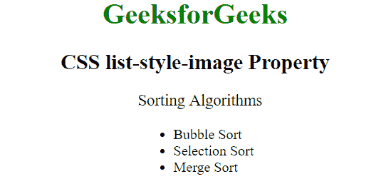
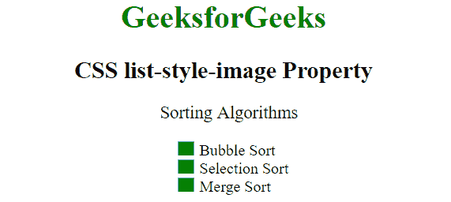

# CSS |列表样式-图像属性

> 原文:[https://www . geesforgeks . org/CSS-list-style-image-property/](https://www.geeksforgeeks.org/css-list-style-image-property/)

CSS 中的列表样式图像属性用于设置将用作列表项标记的图像。

**语法:**

```html
list-style-image: none|url|initial|inherit;
```

**属性值**:

*   **无:**该值指定没有图像用作标记。如果设置了该值，则使用列表样式类型中定义的标记。这是默认值。
    **语法:**

```html
list-style-image: none;
```

**示例:**

```html
<!DOCTYPE html>
<html>
    <head>
    <title>
        CSS list-style-image Property
    </title>
    <style>
        ul  {
          list-style-image: none;
        }
    </style>
    </head>
    <body style = "">
        <h1 style = "color:green;">
            GeeksforGeeks
        </h1>

        <h2>
            CSS list-style-image Property
        </h2>

        <p>Sorting Algorithms</p>

        <ul>
          <li>Bubble Sort</li>
          <li>Selection Sort</li>
          <li>Merge Sort</li>
        </ul>
    </body>
</html>
```

**输出:**


*   **url:** In this value the path to the image is used as a list-item marker.
    **Syntax:**

    ```html
    list-style-image: url;
    ```

    **示例:**

    ```html
    <!DOCTYPE html>
    <html>
        <head>
        <title>
            CSS list-style-image Property
        </title>
        <style>
            ul  {
              list-style-image: 
    url("https://contribute.geeksforgeeks.org/wp-content/uploads/listitem-1.png");
            }
        </style>
        </head>
        <body style = "">
            <h1 style = "color:green;">
                GeeksforGeeks
            </h1>

            <h2>
                CSS list-style-image Property
            </h2>

            <p>Sorting Algorithms</p>

            <ul>
              <li>Bubble Sort</li>
              <li>Selection Sort</li>
              <li>Merge Sort</li>
            </ul>
        </body>
    </html>
    ```

    **输出:**
    

    *   **initial:** This mode sets this property to its default value.
    **Syntax:**

    ```html
    list-style-image: initial;
    ```

    **支持的浏览器:***列表样式图像属性*支持的浏览器如下:

    *   谷歌 Chrome 1.0
    *   Internet Explorer 4.0
    *   Firefox 1.0
    *   Opera 7.0
    *   苹果 Safari 1.0