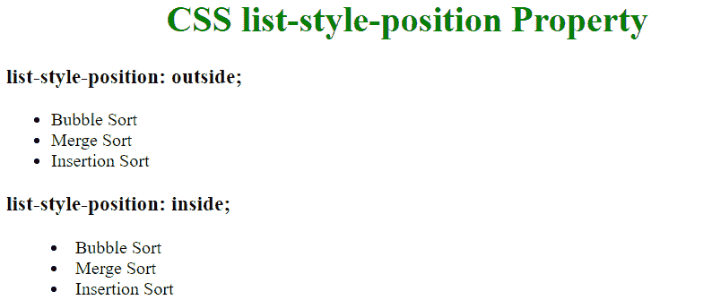

# CSS |列表样式-位置属性

> 原文:[https://www . geesforgeks . org/CSS-list-style-position-property/](https://www.geeksforgeeks.org/css-list-style-position-property/)

CSS 中的**列表样式位置**属性指定了标记框相对于主块框的位置。

**语法:**

```html
list-style-position: outside|inside|initial|inherit;

```

**属性值:**

*   **外部:**在该值中，标记在主块框之外，即项目符号点在列表项之外。这是默认值。
*   **内部:**在该值中，标记是列表项内容中的第一个元素，即项目符号将位于列表项内部。
*   **初始值:**该模式将该属性设置为默认值。

**示例:**

```html
<!DOCTYPE html>
<html>
    <head>
        <title>CSS list-style-position Property</title>
        <style>
        .geek1 {
          list-style-position: outside;
        }
        .geek2 {
          list-style-position: inside;
        }
        </style>
    </head>
    <body>
    <h1 style = "text-align: center; color: green">
        CSS list-style-position Property
    </h1>

    <h3>list-style-position: outside;</h3>
    <ul class="geek1">
      <li>Bubble Sort </li>
      <li>Merge Sort</li>
      <li>Insertion Sort</li>
    </ul>

    <h3>list-style-position: inside;</h3>
    <ul class="geek2">
      <li>Bubble Sort </li>
      <li>Merge Sort</li>
      <li>Insertion Sort</li>
    </ul>
    </body>
</html>
```

**输出:**


**支持的浏览器:**列表样式位置属性支持的浏览器如下:

*   谷歌 Chrome 1.0
*   Internet Explorer 4.0
*   Firefox 1.0
*   Opera 7.0
*   苹果 Safari 1.0