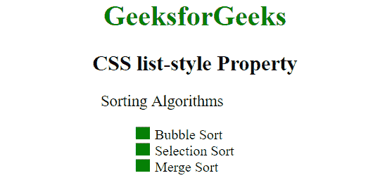
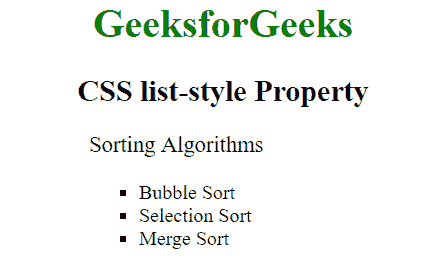

# CSS 列表式属性

> 原文:[https://www.geeksforgeeks.org/css-list-style-property/](https://www.geeksforgeeks.org/css-list-style-property/)

CSS 中的**列表样式** **属性**用于设置列表样式。该属性是其他三个属性的组合，即列表样式类型、列表样式位置和列表样式图像，可以用作这三个属性的[简写符号](geeksforgeeks.org/css-shorthand-properties/)。如果缺少任何一个值，将使用此属性的默认值。

**语法:**

```html
list-style: list-style-type list-style-position list-style-image|initial|inherit;
```

**属性值:**

*   [**列表样式类型**](https://www.geeksforgeeks.org/css-list-style-type-property/) **:** 该值设置列表项元素的标记(如圆盘、字符或自定义计数器样式)。它的默认值是一张光盘。
*   [**【列表样式-位置】**](https://www.geeksforgeeks.org/css-list-style-position-property/) **:** 该值设置标记相对于列表项的位置。它的默认值是“外部”。
*   [**【列表样式-图像】**](https://www.geeksforgeeks.org/css-list-style-image-property/) **:** 该值设置用作列表项标记的图像。它的默认值是“无”。

我们将通过例子来理解列表式属性的概念。

**示例 1:** 该示例说明了**列表样式属性**的使用，其中位置值被设置为内部。

## 超文本标记语言

```html
<!DOCTYPE html>
<html>
<head>
    <title> CSS list-style Property </title>
    <style>
    ul {
        list-style: square inside url(
"https://write.geeksforgeeks.org/wp-content/uploads/listitem-1.png");
    }
    </style>
</head>

<body>
    <h1 style="color:green;">
            GeeksforGeeks
        </h1>
    <h2>
            CSS list-style Property
        </h2>

<p>Sorting Algorithms</p>

    <ul>
        <li>Bubble Sort</li>
        <li>Selection Sort</li>
        <li>Merge Sort</li>
    </ul>
</body>
</html>
```

**输出:**



**示例 2:** 该示例说明了**列表样式属性**的使用，其中位置值被设置为外部。

## 超文本标记语言

```html
<!DOCTYPE html>
<html>
<head>
    <title> CSS list-style Property </title>
    <style>
    ul {
        list-style: square outside;
    }
    </style>
</head>

<body>
    <h1 style="color:green;">
            GeeksforGeeks
        </h1>
    <h2>
            CSS list-style Property
        </h2>

<p>Sorting Algorithms</p>

    <ul>
        <li>Bubble Sort</li>
        <li>Selection Sort</li>
        <li>Merge Sort</li>
    </ul>
</body>
</html>
```

**输出:**



**注意:**如果没有指定列表样式的图像，则视为无。

**支持的浏览器:**列表样式属性支持的浏览器如下:

*   谷歌 Chrome 1.0
*   Internet Explorer 4.0
*   微软边缘 12.0
*   Firefox 1.0
*   Opera 7.0
*   Safari 1.0