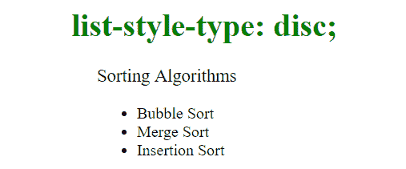

# CSS |列表样式类型属性

> 原文:[https://www.geeksforgeeks.org/css-list-style-type-property/](https://www.geeksforgeeks.org/css-list-style-type-property/)

如果“列表样式图像”的值为“无”，CSS 中的**列表样式类型**属性指定列表项标记的外观(如光盘、字符或自定义计数器样式)。

**语法:**

```html
list-style-type: disc|circle|square|decimal|lower-roman|upper-roman|
lower-greek|lower-latin|upper-latin|lower-alpha|upper-alpha|none|
inherit;

```

**属性值**:

*   **盘:**这是默认值。标记是一个实心圆。
    **语法:**

```html
list-style-type: disc;
```

**示例:**

```html
<!DOCTYPE html>
<html>
    <head>
        <title>CSS list-style-type Property</title>
        <style>
        .geek1 {
          list-style-type: disc;
        }
        </style>
    </head>
    <body>
    <h1 style = "text-align: center; color: green">
        list-style-type: disc;
    </h1>
    <p>Sorting Algorithms</p>
    <ul class="geek1">
      <li>Bubble Sort </li>
      <li>Merge Sort</li>
      <li>Insertion Sort</li>
    </ul>

    </body>
</html>
```

**输出:**


*   **circle:**The marker is a hollow circle.
    **Syntax:**

    ```html
    list-style-type: circle;
    ```

    **示例:**

    ```html
    <!DOCTYPE html>
    <html>
        <head>
            <title>CSS list-style-type Property</title>
            <style>
            .geek1 {
              list-style-type: circle;
            }
            </style>
        </head>
        <body>
        <h1 style = "text-align: center; color: green">
            list-style-type: circle;
        </h1>
        <p>Sorting Algorithms</p>
        <ul class="geek1">
          <li>Bubble Sort </li>
          <li>Merge Sort</li>
          <li>Insertion Sort</li>
        </ul>

        </body>
    </html>
    ```

    **输出:**
    

    *   **square:**The marker is a square.
    **Syntax:**

    ```html
    list-style-type: square;
    ```

    **示例:**

    ```html
    <!DOCTYPE html>
    <html>
        <head>
            <title>CSS list-style-type Property</title>
            <style>
            .geek1 {
              list-style-type: square;
            }
            </style>
        </head>
        <body>
        <h1 style = "text-align: center; color: green">
            list-style-type: square;
        </h1>
        <p>Sorting Algorithms</p>
        <ul class="geek1">
          <li>Bubble Sort </li>
          <li>Merge Sort</li>
          <li>Insertion Sort</li>
        </ul>

        </body>
    </html>
    ```

    **输出:**
    

    *   **decimal:**The marker is a decimal numbers, beginning with 1.
    **Syntax:**

    ```html
    list-style-type: decimal;
    ```

    **示例:**

    ```html
    <!DOCTYPE html>
    <html>
        <head>
            <title>CSS list-style-type Property</title>
            <style>
            .geek1 {
              list-style-type: decimal;
            }
            </style>
        </head>
        <body>
        <h1 style = "text-align: center; color: green">
            list-style-type: decimal;
        </h1>
        <p>Sorting Algorithms</p>
        <ul class="geek1">
          <li>Bubble Sort </li>
          <li>Merge Sort</li>
          <li>Insertion Sort</li>
        </ul>

        </body>
    </html>
    ```

    **输出:**
    

    *   **lower-roman:**The marker is a lowercase roman numerals (i, ii, iii, iv, v, etc.).

    **语法:**

    ```html
    list-style-type: lower-roman;
    ```

    **示例:**

    ```html
    <!DOCTYPE html>
    <html>
        <head>
            <title>CSS list-style-type Property</title>
            <style>
            .geek1 {
              list-style-type: lower-roman;
            }
            </style>
        </head>
        <body>
        <h1 style = "text-align: center; color: green">
            list-style-type: lower-roman;
        </h1>
        <p>Sorting Algorithms</p>
        <ul class="geek1">
          <li>Bubble Sort </li>
          <li>Merge Sort</li>
          <li>Insertion Sort</li>
        </ul>

        </body>
    </html>
    ```

    **输出:**
    

    *   **upper-roman:**The marker is a uppercase roman numerals (I, II, III, IV, V, etc.).

    **语法:**

    ```html
    list-style-type: upper-roman;
    ```

    **示例:**

    ```html
    <!DOCTYPE html>
    <html>
        <head>
            <title>CSS list-style-type Property</title>
            <style>
            .geek1 {
              list-style-type: upper-roman;
            }
            </style>
        </head>
        <body>
        <h1 style = "text-align: center; color: green">
            list-style-type: upper-roman;
        </h1>
        <p>Sorting Algorithms</p>
        <ul class="geek1">
          <li>Bubble Sort </li>
          <li>Merge Sort</li>
          <li>Insertion Sort</li>
        </ul>

        </body>
    </html>
    ```

    **输出:**
    

    *   **lower-greek:**The marker is a lowercase classical Greek alpha, beta, gamma, … (?, ?, ?, …).

    **语法:**

    ```html
    list-style-type: lower-greek;
    ```

    **示例:**

    ```html
    <!DOCTYPE html>
    <html>
        <head>
            <title>CSS list-style-type Property</title>
            <style>
            .geek1 {
              list-style-type: lower-greek;
            }
            </style>
        </head>
        <body>
        <h1 style = "text-align: center; color: green">
            list-style-type: lower-greek;
        </h1>
        <p>Sorting Algorithms</p>
        <ul class="geek1">
          <li>Bubble Sort </li>
          <li>Merge Sort</li>
          <li>Insertion Sort</li>
        </ul>

        </body>
    </html>
    ```

    **输出:**
    

    *   **lower-latin:**The marker is a lowercase ascii letters (a, b, c, … z).

    **语法:**

    ```html
    list-style-type: lower-latin;
    ```

    **示例:**

    ```html
    <!DOCTYPE html>
    <html>
        <head>
            <title>CSS list-style-type Property</title>
            <style>
            .geek1 {
              list-style-type: lower-latin;
            }
            </style>
        </head>
        <body>
        <h1 style = "text-align: center; color: green">
            list-style-type: lower-latin;
        </h1>
        <p>Sorting Algorithms</p>
        <ul class="geek1">
          <li>Bubble Sort </li>
          <li>Merge Sort</li>
          <li>Insertion Sort</li>
        </ul>

        </body>
    </html>
    ```

    **输出:**
    

    *   **upper-latin:**The marker is a uppercase ascii letters (A, B, C, … Z).

    **语法:**

    ```html
    list-style-type: upper-latin;
    ```

    **示例:**

    ```html
    <!DOCTYPE html>
    <html>
        <head>
            <title>CSS list-style-type Property</title>
            <style>
            .geek1 {
              list-style-type: upper-latin;
            }
            </style>
        </head>
        <body>
        <h1 style = "text-align: center; color: green">
            list-style-type: upper-latin;
        </h1>
        <p>Sorting Algorithms</p>
        <ul class="geek1">
          <li>Bubble Sort </li>
          <li>Merge Sort</li>
          <li>Insertion Sort</li>
        </ul>

        </body>
    </html>
    ```

    **输出:**
    

    *   **none:**No marker is shown in this mode.
    **Syntax:**

    ```html
    list-style-type: none;
    ```

    **示例:**

    ```html
    <!DOCTYPE html>
    <html>
        <head>
            <title>CSS list-style-type Property</title>
            <style>
            .geek1 {
              list-style-type: none;
            }
            </style>
        </head>
        <body>
        <h1 style = "text-align: center; color: green">
            list-style-type: none;
        </h1>
        <p>Sorting Algorithms</p>
        <ul class="geek1">
          <li>Bubble Sort </li>
          <li>Merge Sort</li>
          <li>Insertion Sort</li>
        </ul>

        </body>
    </html>
    ```

    **输出:**
    

    **注:** **下-alpha****上-alpha** 分别与下拉丁、上拉丁相同。
    **支持的浏览器:**列表样式类型属性支持的浏览器如下:

    *   谷歌 Chrome 1.0
    *   Internet Explorer 4.0
    *   Firefox 1.0
    *   Opera 7.0
    *   苹果 Safari 1.0