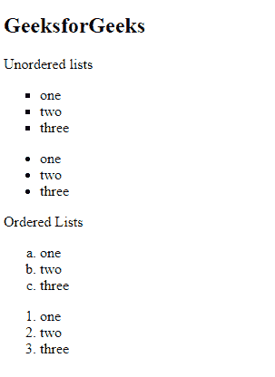
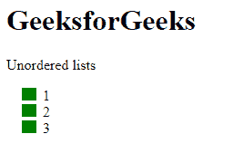
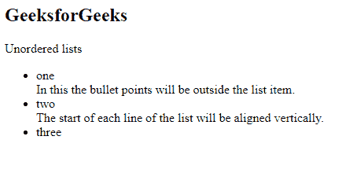
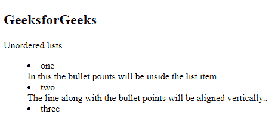
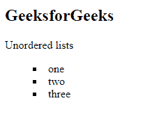
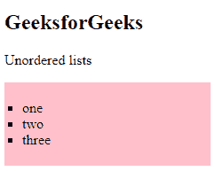
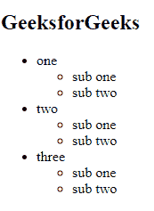

# CSS 列表

> 原文:[https://www.geeksforgeeks.org/css-lists/](https://www.geeksforgeeks.org/css-lists/)

CSS 中的**列表**以特定的方式指定了内容或项目的列表，即可以是有序的，也可以是无序的，这有助于制作一个干净的网页。它可以用来安排各种内容的巨大，因为它们灵活且易于管理。列表的默认样式是无边框的。该列表可分为两种类型:

*   [**【无序列表】**](https://www.geeksforgeeks.org/html-ul-tag/)【T4:】在无序列表中，列表项默认用项目符号标注，即黑色小圆圈。
*   [**有序列表**](https://www.geeksforgeeks.org/html-ol-tag/) **:** 在有序列表中，列表项用数字和一个字母标记。

**列表项目标记:**该属性指定项目标记的类型，即无序列表或有序列表。[列表样式类型](https://www.geeksforgeeks.org/css-list-style-type-property/)属性指定列表项元素的列表项标记(如圆盘、字符或自定义计数器样式)的外观。它的默认值是一张光盘。

**语法:**

```html
list-style-type:value;
```

可以使用以下值:

*   圆
*   十进制，如:1，2，3 等
*   十进制前导零，如:01，02，03，04 等
*   下罗马人
*   上罗马
*   较低的α值，如 a、b、c 等
*   上阿尔法(如:甲、乙、丙等)
*   平方

**示例**:本示例描述了带有各种列表样式类型的 CSS 列表，其中值被设置为方形&下阿尔法。

## 超文本标记语言

```html
<!DOCTYPE html>
<html>

<head>
    <style>
    ul.a {
        list-style-type: square;
    }

    ol.c {
        list-style-type: lower-alpha;
    }
    </style>
</head>

<body>
    <h2>
         GeeksforGeeks
      </h2>

<p> Unordered lists </p>

    <ul class="a">
        <li>one</li>
        <li>two</li>
        <li>three</li>
    </ul>
    <ul class="b">
        <li>one</li>
        <li>two</li>
        <li>three</li>
    </ul>

<p> Ordered Lists </p>

    <ol class="c">
        <li>one</li>
        <li>two</li>
        <li>three</li>
    </ol>
    <ol class="d">
        <li>one</li>
        <li>two</li>
        <li>three</li>
    </ol>
</body>

</html>
```

**输出:**



**图像作为列表标记:**该属性将图像指定为列表项标记。[列表样式图像](https://www.geeksforgeeks.org/css-list-style-image-property/)属性用于设置要用作列表项标记的图像。它的默认值是“无”。

**语法:**

```html
list-style-image: url;
```

**示例**:本示例描述了带有各种列表样式图像的 CSS 列表，其中的值被设置为图像的 url。

## 超文本标记语言

```html
<!DOCTYPE html>
<html>

<head>
    <title> CSS list-style-image Property </title>
    <style>
    ul {
        list-style-image: url(
"https://contribute.geeksforgeeks.org/wp-content/uploads/listitem-1.png");
    }
    </style>
</head>

<body>
    <h1>
            GeeksforGeeks
        </h1>

<p> Unordered lists </p>

    <ul>
        <li>1</li>
        <li>2</li>
        <li>3</li>
    </ul>
</body>

</html>
```

**输出:**



**列表标记位置:**该属性指定列表项标记的位置。[列表样式位置](https://www.geeksforgeeks.org/css-list-style-position-property/)属性用于设置标记相对于列表项的位置。它的默认值是“外部”。

有两种类型的位置标记:

*   **列表-样式-位置:外部；**在这种情况下，项目符号将在列表项之外。列表中每一行的开始都将垂直对齐。

**语法:**

```html
list-style-position: outside;
```

**示例**:本示例描述了带有各种列表样式位置的 CSS 列表，其中值被设置为外部。

## 超文本标记语言

```html
<!DOCTYPE html>
<html>

<head>
    <style>
    ul.a {
        list-style-position: outside;
    }
    </style>
</head>

<body>
    <h2>
         GeeksforGeeks
      </h2>

<p> Unordered lists </p>

    <ul class="a">
        <li>one
            <br>
          In this the bullet points will be outside the list item.</li>
        <li>two
            <br>
          The start of each line of the list will be aligned vertically. </li>
        <li>three</li>
    </ul>
</body>

</html>
```

**输出:**



**列表-样式-位置:** **内；**在这种情况下，项目符号点将在列表内部。线条和项目符号点将垂直对齐。

**语法:**

```html
list-style-position: inside;
```

**示例**:本示例描述了带有各种列表样式位置的 CSS 列表，其中值被设置为内部。

## 超文本标记语言

```html
<!DOCTYPE html>
<html>

<head>
    <style>
    ul.a {
        list-style-position: inside;
    }
    </style>
</head>

<body>
    <h2>
         GeeksforGeeks
      </h2>

<p> Unordered lists </p>

    <ul class="a">
        <li>one
            <br> 
          In this the bullet points will be inside the list item.</li>
        <li>two
            <br> 
          The line along with the bullet points will be aligned vertically.. </li>
        <li>three</li>
    </ul>
</body>

</html>
```

**输出:**



[**简写属性**](https://www.geeksforgeeks.org/css-shorthand-properties/) **:** 该属性允许我们在一个命令中设置所有列表属性。属性的顺序是类型、位置和图像。如果缺少任何属性，将插入默认值。

**示例**:本示例使用速记属性描述 CSS 列表。

## 超文本标记语言

```html
<!DOCTYPE html>
<html>

<head>
    <style>
    ul.a {
        list-style: square inside;
    }
    </style>
</head>

<body>
    <h2>
         GeeksforGeeks
      </h2>

<p> Unordered lists </p>

    <ul class="a">
        <li>one</li>
        <li>two</li>
        <li>three</li>
    </ul>
</body>

</html>
```

**输出:**



**样式列表:**列表可以用 CSS 格式化。可以为列表设置不同的颜色、边框、背景和填充。

**示例**:本示例描述了将各种样式属性应用于元素的 CSS 列表。

## 超文本标记语言

```html
<!DOCTYPE html>
<html>

<head>
    <style>
    ul.a {
        list-style: square;
        background: pink;
        padding: 20px;
    }
    </style>
</head>

<body>
    <h2>
         GeeksforGeeks
      </h2>

<p> Unordered lists </p>

    <ul class="a">
        <li>one</li>
        <li>two</li>
        <li>three</li>
    </ul>
</body>

</html>
```

**输出:**



**嵌套列表:**列表也可以嵌套。我们有分区的子分区，所以我们需要列表的嵌套。

**示例**:本示例描述了在另一个列表中声明了一个列表的 CSS 列表。

## 超文本标记语言

```html
<!DOCTYPE html>
<html>

<head></head>

<body>
    <h2>
          GeeksforGeeks
      </h2>
    <ul>
        <li> one
            <ul>
                <li>sub one</li>
                <li>sub two</li>
            </ul>
        </li>
        <li> two
            <ul>
                <li>sub one</li>
                <li>sub two</li>
            </ul>
        </li>
        <li> three
            <ul>
                <li>sub one</li>
                <li>sub two</li>
            </ul>
        </li>
    </ul>
</body>

</html>
```

**输出:**



**支持的浏览器:**

*   谷歌 Chrome 95.0
*   微软边缘 95.0
*   Firefox 93.0
*   Internet Explorer 11.0
*   Opera 80.0
*   Safari 15.0