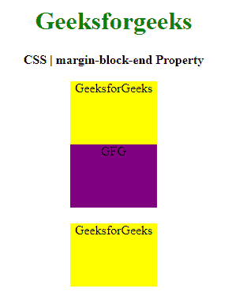
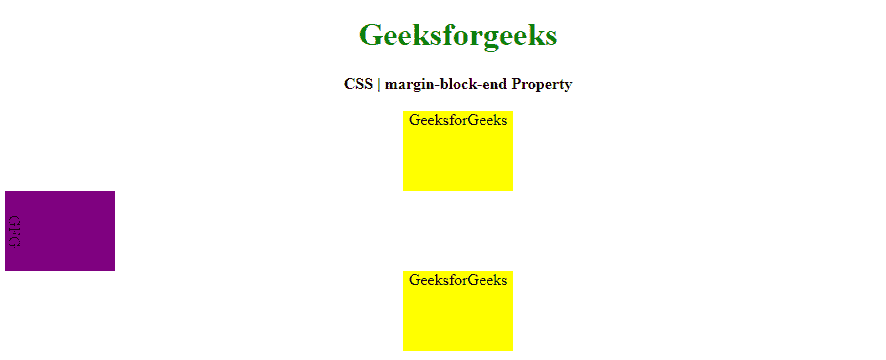

# CSS |边距-区块-结束属性

> 原文:[https://www . geesforgeks . org/CSS-margin-block-end-property/](https://www.geeksforgeeks.org/css-margin-block-end-property/)

**边距块结束属性**用于定义元素的逻辑块结束边距。此属性有助于根据元素的书写模式、方向和文本方向来放置边距。
**语法:**

```
margin-block-end: length | auto | initial | inherit;
```

**房产价值:**

*   **长度:**设置以 px、cm、pt 定义的固定值。允许负值。0px 是默认值。
*   **自动:**当希望浏览器确定左边距的宽度时使用。
*   **初始值:**用于将左边距属性的值设置为默认值。
*   **inherit:** 当希望元素继承其父元素的左边距属性作为自己的属性时使用。

以下示例说明 CSS 中的**边距块结束属性**:
**示例 1:**

## 超文本标记语言

```
<!DOCTYPE html>
<html>

<head>
    <title>CSS | margin-block-end Property</title>
    <style>
        h1 {
            color: green;
        }

        div {
            background-color: yellow;
            width: 110px;
            height: 80px;
        }
        .two {
              margin-block-end: 20px;
              background-color: purple;
        }
    </style>
</head>

<body>
    <center>
        <h1>Geeksforgeeks</h1>
        <b>CSS | margin-block-end Property</b>
        <br><br>
        <div class="one">GeeksforGeeks</div>
        <div class="two">GFG</div>
        <div class="three">GeeksforGeeks</div>
    </center>
</body>

</html>
```

**输出:**



**例 2:**

## 超文本标记语言

```
<!DOCTYPE html>
<html>

<head>
    <title>CSS | margin-block-end Property</title>
    <style>
        h1 {
            color: green;
        }

        div {
            background-color: yellow;
            width: 110px;
            height: 80px;
        }
        .two {
            margin-block-end: auto;
            writing-mode: vertical-lr;
            background-color: purple;
        }
    </style>
</head>

<body>
    <center>
        <h1>Geeksforgeeks</h1>
        <b>CSS | margin-block-end Property</b>
        <br><br>
        <div class="one">GeeksforGeeks</div>
        <div class="two">GFG</div>
        <div class="three">GeeksforGeeks</div>
    </center>
</body>

</html>
```

**输出:**



**支持的浏览器:****边距块结束属性**支持的浏览器如下:

*   谷歌 Chrome
*   微软公司出品的 web 浏览器
*   Mozilla Firefox