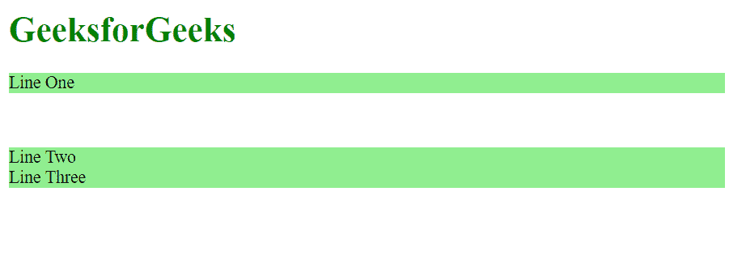
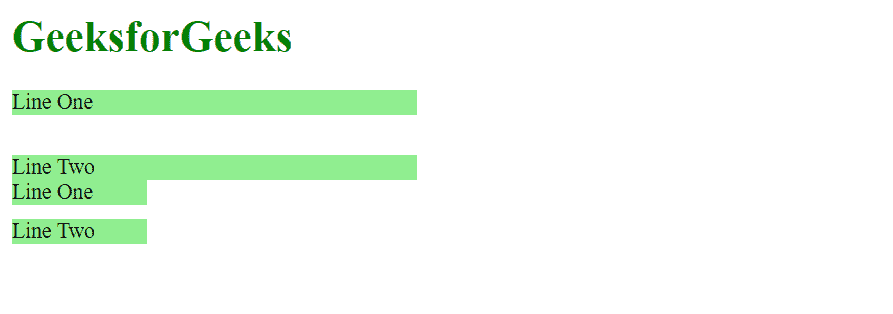

# CSS 边距-底部属性

> 原文:[https://www.geeksforgeeks.org/css-margin-bottom-property/](https://www.geeksforgeeks.org/css-margin-bottom-property/)

CSS **边距-底部**属性用于指定元素底部使用的边距量。可以根据长度或百分比来设置边距。

**语法:**

```html
margin-bottom: <length> | <percentage> | auto

```

**属性值**:

*   **Length:** This value specifies the length of margin with a fixed value. This value can be positive, negative or zero.

    **示例:**

    ```html
    <!DOCTYPE html>
    <html>
    <head>
        <title>CSS margin-bottom</title>
        <style>
            div{
                background-color: lightgreen;
            }
        </style>
    </head>
    <body>
        <h1 style="color: green">GeeksforGeeks</h1>

        <!-- margin-bottom for below div 
            is set to 50px -->
        <div style="margin-bottom: 50px">Line One</div>

        <!-- margin-bottom for below div 
            is set to 0px -->
        <div style="margin-bottom: 0px">Line Two</div>

        <div>Line Three</div>
    </body>
    </html>                    
    ```

    **输出** :
    

*   **Percentage:** This value specifies the amount of margin as a percentage relative to the width of the containing element.

    **示例:**

    ```html
    <!DOCTYPE html>
    <html>
    <head>
        <title>CSS margin-bottom</title>
        <style>
            h1 {
                color: green;
            }

            .larger {
                width: 300px;
                background-color: white;
            }

            .smaller {
                width: 100px;
                background-color: white;
            }

            div{
                background-color: lightgreen;
            }
        </style>
    </head>
    <body>
        <h1>GeeksforGeeks</h1>

        <!-- margin-bottom is set to 10% with width of 
            containing box set to 300px -->
        <div class="larger">
            <div style="margin-bottom: 10%";>Line One</div>
            <div>Line Two</div>
        </div>

        <!-- margin-bottom is set to 10% with width of 
            containing box set to 100px -->
        <div class="smaller">
            <div style="margin-bottom: 10%;">Line One</div>
            <div>Line Two</div>
        </div>
    </body>
    </html>                    
    ```

    **输出** :
    

*   **自动:**如果该属性的值设置为“自动”，则浏览器会自动为边距大小计算一个合适的值。

**支持的浏览器:***页边空白*属性支持的浏览器如下:

*   谷歌 Chrome
*   微软公司出品的 web 浏览器
*   火狐浏览器
*   歌剧
*   旅行队