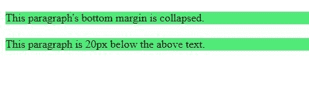
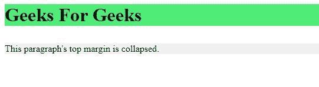

# CSS 边距折叠

> 原文:[https://www.geeksforgeeks.org/css-margin-collapse/](https://www.geeksforgeeks.org/css-margin-collapse/)

CSS 边距属性用于设置元素所有四边的边距。
当页面上两个元素垂直相邻时，其中一个元素可能会失去垂直边距。这意味着元素的上边距和下边距有时会合并成一个边距。单个边距等于折叠的两个边距中最大的一个。
**例:**

## 超文本标记语言

```html
<!DOCTYPE html>
<!DOCTYPE html>
<html lang="en" dir="ltr">
    <head>
       <style>
           p{
               margin: 20px 0 10px;
               background-color:rgb(79, 236, 119);
           }
       </style>
    </head>
    <body>

<p>This paragraph's bottom margin is collapsed.</p>

<p>This paragraph is 20px below the above text.</p>

    </body>
</html>
```

你会期望两段之间的边距是 30px(第一段的 10px 下边距+下一段的 20px 上边距)。但是在 CSS 中，更大的边界覆盖，实际的边界更大(20px)。
**输出:**



如果一个元素有负边距，则从正边距中减去负边距。例如，40px 和-30px 的合成余量将是 10px (40px-30px)。如果两个边距都为负，则使用更大的负值。例如，-20px 和-50px 的合成余量将是-50px。
浮动元素和绝对定位元素的边距永远不会塌陷。
**利润率崩溃的一些具体案例:**

*   **相邻元素之间:**
    垂直相邻元素的边距会像我们在前面的示例中看到的那样折叠。
*   **父元素和子元素之间:**
    当相邻边距之间不存在填充、边框或内容时，父元素和子元素的相邻边距会折叠。

**例:**

## 超文本标记语言

```html
<!DOCTYPE html>
<html lang="en" dir="ltr">
    <head>
       <style>
           h1{
              margin: 0;
              background-color: rgb(79, 236, 119);
           }

           div{
               margin: 30px 0 20px ;
           }

           p{
               margin: 20px 0 10px;
               background-color: #f0f0f0;
           }
       </style>
    </head>
    <body>
        <h1>Geeks For Geeks</h1>
        <div>

<p>This paragraph's top
              margin is collapsed.</p>

        </div>
    </body>
</html>
```

**输出:**



这里 h1 和 div 之间的边距是 30px，而不是 50px (30px + 20px)。

**支持的浏览器:**

*   谷歌 Chrome
*   微软公司出品的 web 浏览器
*   火狐浏览器
*   歌剧
*   狩猎