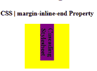
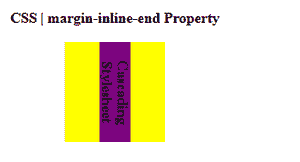

# CSS |边距-内联-结束属性

> 原文:[https://www . geesforgeks . org/CSS-margin-inline-end-property/](https://www.geeksforgeeks.org/css-margin-inline-end-property/)

**边距内联结束属性**用于定义元素的逻辑内联结束边距。此属性有助于根据元素的书写模式、方向和文本方向来放置边距。
**语法:**

```
margin-inline-end: length | auto | initial | inherit | unset;
```

**房产价值:**

*   **长度:**设置以 px、cm、pt 定义的固定值。也允许负值。0px 是默认值。
*   **自动:**当希望浏览器确定左边距的宽度时使用。
*   **初始值:**用于将左边距属性的值设置为默认值。
*   **inherit:** 当希望元素继承其父元素的左边距属性作为自己的属性时使用。
*   **取消设置:**用于取消设置默认边距块。

以下示例说明 CSS 中的**边距内联结束属性**:
**示例 1:**

## 超文本标记语言

```
<!DOCTYPE html>
<html>

<head>
    <title>CSS | margin-inline-end Property</title>
    <style>
        h1 {
            color: green;
        }

        div {
            background-color: yellow;
            width: 110px;
            height: 110px;
        }
        .geek {
            background-color: purple;
            writing-mode: vertical-rl;
            margin-inline-end: 20px;
        }
    </style>
</head>

<body>
    <center>
        <h1>Geeksforgeeks</h1>
        <b>CSS | margin-inline-end Property</b>
        <br><br>
        <div>
            <b class="geek">Cascading Stylesheet</b>
        </div>

    </center>
</body>

</html>                       
```

**输出:**



**例 2:**

## 超文本标记语言

```
<!DOCTYPE html>
<html>

<head>
    <title>CSS | margin-inline-end Property</title>
    <style>
        h1 {
            color: green;
        }

        div {
            background-color: yellow;
            width: 110px;
            height: 110px;
        }
        .geek {
            background-color: purple;
            writing-mode: vertical-rl;
            margin-inline-end: auto;
        }
    </style>
</head>

<body>
    <center>
        <h1>Geeksforgeeks</h1>
        <b>CSS | margin-inline-end Property</b>
        <br><br>
        <div>
            <b class="geek">Cascading Stylesheet</b>
        </div>

    </center>
</body>

</html>                                               
```

**输出:**



**参考:**[【https://docs.w3cub.com/css/margin-inline-end/】](https://docs.w3cub.com/css/margin-inline-end/)
**支持的浏览器:**支持的浏览器**边距内联结束属性**如下:

*   微软公司出品的 web 浏览器
*   Mozilla Firefox