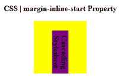
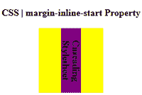

# CSS |边距-内联-开始属性

> 原文:[https://www . geesforgeks . org/CSS-margin-inline-start-property/](https://www.geeksforgeeks.org/css-margin-inline-start-property/)

CSS 中的**边距内联开始属性**用于定义元素的逻辑内联开始边距。此属性有助于根据元素的书写模式、方向和文本方向来放置边距。

**语法:**

```html
margin-inline-start: length | auto | initial | inherit | unset;
```

**属性值:**

*   **长度:**设置 px、cm、pt 等定义的固定值。允许负值。它的默认值。
*   **自动:**当希望浏览器确定左边距的宽度时使用。
*   **初始值:**用于将 margin-inline-start 属性的值设置为默认值。
*   **inherit:** 当希望元素继承其父元素的 margin-inline-start 属性作为自己的属性时使用。
*   **取消设置:**用于取消设置默认边距块。

以下示例说明了 CSS 中的**边距内联开始属性**:

**例 1:**

## 超文本标记语言

```html
<!DOCTYPE html>
<html>

<head>
    <style>
        h1 {
            color: green;
        }

        div {
            background-color: yellow;
            width: 110px;
            height: 110px;
        }
        .geek {
            background-color: purple;
            writing-mode: vertical-rl;
            margin-inline-start: 20px;
        }
    </style>
</head>

<body>
    <center>
        <h1>Geeksforgeeks</h1>
        <b>CSS | margin-inline-start Property</b>
        <br><br>
        <div>
            <b class="geek">Cascading Stylesheet</b>
        </div>
    </center>
</body>

</html>                       
```

**输出:**



**例 2:**

## 超文本标记语言

```html
<!DOCTYPE html>
<html>

<head>
    <style>
        h1 {
            color: green;
        }

        div {
            background-color: yellow;
            width: 110px;
            height: 110px;
        }
        .geek {
            background-color: purple;
            writing-mode: vertical-rl;
            margin-inline-start: auto;
        }
    </style>
</head>

<body>
    <center>
        <h1>Geeksforgeeks</h1>
        <b>CSS | margin-inline-start Property</b>
        <br><br>
        <div>
            <b class="geek">Cascading Stylesheet</b>
        </div>
    </center>
</body>

</html>                                               
```

**输出:**



**支持的浏览器:****边距内联开始属性**支持的浏览器如下:

*   谷歌 Chrome
*   微软公司出品的 web 浏览器
*   Mozilla Firefox