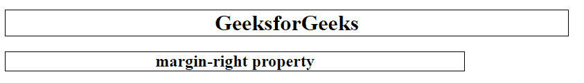
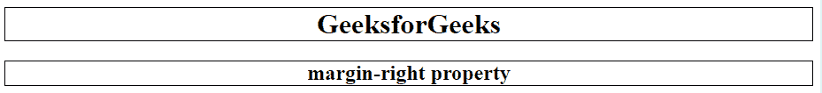

# CSS |保证金权利属性

> 原文:[https://www.geeksforgeeks.org/css-margin-right-property/](https://www.geeksforgeeks.org/css-margin-right-property/)

CSS 中的右边距属性用于设置元素的右边距。它设置元素右侧的边距区域。也允许负值。保证金权利属性的默认值为零。

**语法:**

```css
margin-right: length|auto|initial|inherit;
```

**属性值:**

*   **length:** This property is used to set a fixed value defined in px, cm, pt etc. The negative value is allowed and the default value is 0px.

    **语法:**

    ```css
    margin-right: length;
    ```

    **示例:**

    ```css
    <!DOCTYPE html>
    <html>
        <head>
            <title>
                margin-right property
            </title>

            <!-- margin-right property -->
            <style>
                h1 {
                    margin-right: 100px;
                    border:1px solid black;
                }
                h2 {
                    margin-right:250px;
                    border:1px solid black;
                }
            </style>
        </head>

        <body style = "text-align:center">
            <h1>GeeksforGeeks</h1>
            <h2>margin-right property</h2>
        </body>
    </html>                    
    ```

    **输出:**
    

*   **auto:** This property is used when it is desired and it is determined by browser.

    **语法:**

    ```css
    margin-right: auto;
    ```

    **示例:**

    ```css
    <!DOCTYPE html>
    <html>
        <head>
            <title>
                margin-right property
            </title>

            <!-- margin-right property -->
            <style>
                h1 {
                    margin-right: auto;
                    border:1px solid black;
                }
                h2 {
                    margin-right:auto;
                    border:1px solid black;
                }
            </style>
        </head>

        <body style = "text-align:center">
            <h1>GeeksforGeeks</h1>
            <h2>margin-right property</h2>
        </body>
    </html>                    
    ```

    **输出:**
    

*   **initial** It sets the value of right-margin to its default value.

    **语法:**

    ```css
    margin-right: initial;
    ```

    **示例:**

    ```css
    <!DOCTYPE html>
    <html>
        <head>
            <title>
                margin-right property
            </title>

            <!-- margin-right property -->
            <style>
                h1 {
                    margin-right: initial;
                    border:1px solid black;
                }
                h2 {
                    margin-right:initial;
                    border:1px solid black;
                }
            </style>
        </head>

        <body style = "text-align:center">
            <h1>GeeksforGeeks</h1>
            <h2>margin-right property</h2>
        </body>
    </html>                    
    ```

    **输出:**
    

*   **inherit:** 此属性从其父级继承。

**支持的浏览器:***右边距*属性支持的浏览器如下:

*   谷歌 Chrome 1.0
*   Internet Explorer 6.0
*   Firefox 1.0
*   Safari 1.0
*   歌剧 3.5