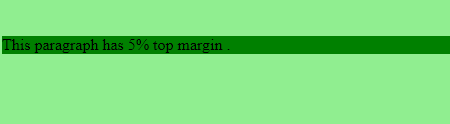
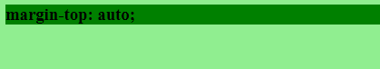
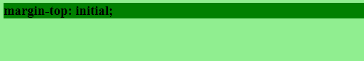
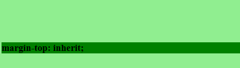

# CSS |页边距顶端属性

> 原文:[https://www.geeksforgeeks.org/css-margin-top-property/](https://www.geeksforgeeks.org/css-margin-top-property/)

CSS 中的上边距属性用于设置元素的上边距。它设置元素顶部的边距区域。上边距属性的默认值为 0。

**语法:**

```css
margin-top: length|auto|initial|inherit;
```

**属性值:**

*   **length:** It is used to specify the length of margin with a fixed value. This value can be positive, negative or zero.

    **语法:**

    ```css
    margin-top: length;
    ```

    **示例:**

    ```css
    <!DOCTYPE html>
    <html>
        <head>
            <title>margin-top property</title>

            <!-- margin-top CSS property -->
            <style>
                p {
                    margin-top:50px; 
                    background-color:green;
                }
            </style>
        </head>

        <body style = "background-color:lightgreen;">

            <!-- margin-top property used here -->
            <p style = "">
                This paragraph has 50px top margin .
            </p>
        </body>
    </html>                    
    ```

    **输出:**
    

*   **percentage (%):** It is used to specify the amount of margin as a percentage relative to the width of the containing element.

    **语法:**

    ```css
    margin-top: %;
    ```

    **示例:**

    ```css
    <!DOCTYPE html>
    <html>
        <head>
            <title>margin-top property</title>

            <!-- margin-top CSS property -->
            <style>
                p {
                    margin-top:5%; 
                    background-color:green;
                }
            </style>
        </head>

        <body style = "background-color:lightgreen;">

            <!-- margin-top property used here -->
            <p style = "">
                This paragraph has 5% top margin .
            </p>
        </body>
    </html>                    
    ```

    **输出:**
    

*   **auto:** This property is used when margin-top is determined by the browser.

    **语法:**

    ```css
    margin-top: auto;
    ```

    **示例:**

    ```css
    <!DOCTYPE html>
    <html>
        <head>
            <title>margin-top property</title>

            <!-- margin-top CSS property -->
            <style>
                h3 {
                    margin-top:auto; 
                    background-color:green;
                }
            </style>
        </head>

        <body style = "background-color:lightgreen;">

            <!-- margin-top property used here -->
            <h3 style = "">
                margin-top: auto;
            </h3>
        </body>
    </html>                    
    ```

    **输出:**
    

*   **initial** It is used to set margin-top property to its default value.

    **语法:**

    ```css
    margin-top: initial;
    ```

    **示例:**

    ```css
    <!DOCTYPE html>
    <html>
        <head>
            <title>margin-top property</title>

            <!-- margin-top CSS property -->
            <style>
                h3 {
                    margin-top:initial; 
                    background-color:green;
                }
            </style>
        </head>

        <body style = "background-color:lightgreen;">

            <!-- margin-top property used here -->
            <h3 style = "">
                margin-top: initial;
            </h3>
        </body>
    </html>                    
    ```

    **输出:**
    

*   **inherit:** It is used when margin-top property is inherited from its parent.

    **语法:**

    ```css
    margin-top: inherit;
    ```

    **示例:**

    ```css
    <!DOCTYPE html>
    <html>
        <head>
            <title>margin-top property</title>

            <!-- margin-top CSS property -->
            <style>
                .gfg {
                    margin-top:100px;
                }
                h3 {
                    margin-top:inherit; 
                    background-color:green;
                }
            </style>
        </head>

        <body style = "background-color:lightgreen;">

            <div class = "gfg">

                <!-- margin-top property used here -->
                <h3 style = "">
                    margin-top: inherit;
                </h3>
            </div>
        </body>
    </html>                    
    ```

    **输出:**
    

**注意:**元素的上边距和下边距有时会折叠成一个边距，该边距等于两个边距中最大的一个。这不会发生在水平(左和右)页边距上，而只会发生在垂直(上和下)页边距上。这叫做边际崩溃。

**支持的浏览器:***页边距顶级属性*支持的浏览器如下:

*   谷歌 Chrome 1.0
*   Internet Explorer 6.0
*   Firefox 1.0
*   歌剧 3.5
*   Safari 1.0