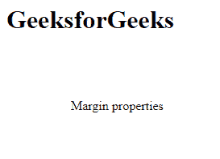
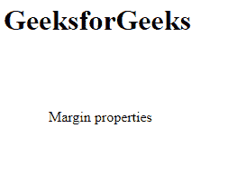
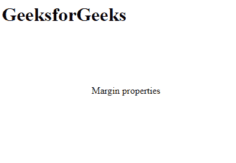
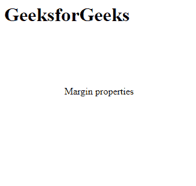
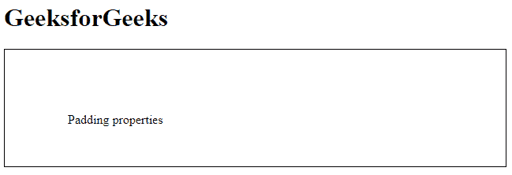
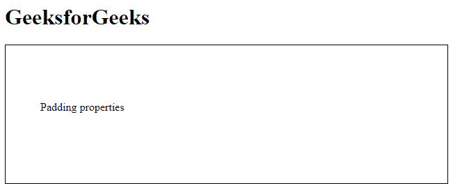
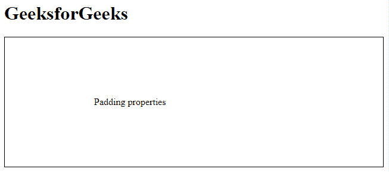
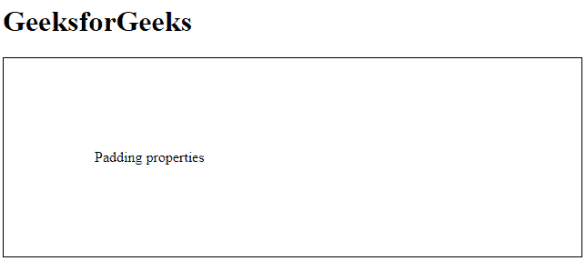
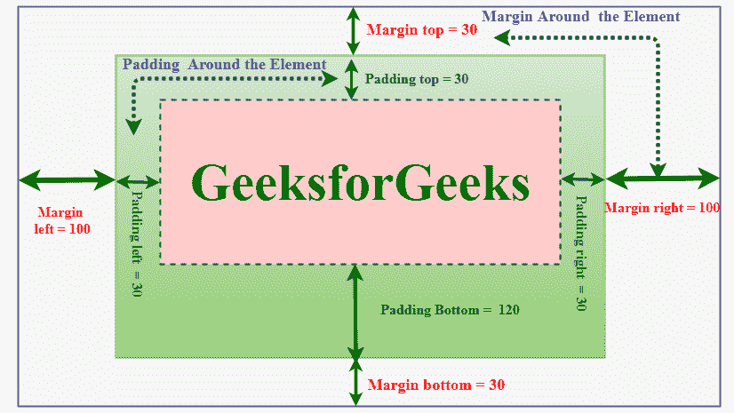
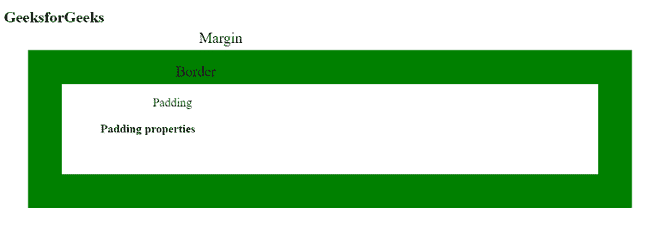

# CSS 边距和填充

> 原文:[https://www.geeksforgeeks.org/css-margins-padding/](https://www.geeksforgeeks.org/css-margins-padding/)

在本文中，我们将了解 [Box 模型](https://www.geeksforgeeks.org/css-box-model/) &的 CSS 边距和填充属性，并通过示例了解它们的实现。

**CSS 边距:** CSS 边距用于在元素周围创建空间。我们可以为各个边(上、右、下、左)设置不同大小的边距。

边距属性可以有以下值:

*   长度单位为厘米、像素、像素等。
*   元素的宽度%。
*   浏览器计算的利润:自动。

**语法:**

```
body
{
    margin: size;
}
```

边距属性是一种[简写属性](https://www.geeksforgeeks.org/css-shorthand-properties/)，具有以下单独的边距属性:

*   [边距-顶部](https://www.geeksforgeeks.org/css-margin-top-property/):用于设置元素的上边距。
*   [右边距](https://www.geeksforgeeks.org/css-margin-right-property/):用于设置元素的右边距。
*   [边距-底部](https://www.geeksforgeeks.org/css-margin-bottom-property/):用于指定元素底部要使用的边距量。
*   [左边距](https://www.geeksforgeeks.org/css-margin-left-property/):用于设置所需元素左边距的宽度。

**注意:**边距属性允许负值。

我们将依次讨论所有 4 个属性。

**如果边距属性有 4 个值:**

```
margin: 40px 100px 120px 80px;
```

*   **top = 40px**
*   **右侧= 100px**
*   **底部= 120px**
*   **左= 80px**

**示例**:本示例通过指定四个值来描述边距属性。

## 超文本标记语言

```
<html>

<head>
    <style>
    p {
        margin: 80px 100px 50px 80px;
    }
    </style>
</head>

<body>
    <h1>
         GeekforGeeks
      </h1>

<p> Margin properties </p>

</body>

</html>
```

**输出:**



**如果边距属性有 3 个值:**

```
margin: 40px 100px 120px; 
```

*   top = 40px
*   **左右= 100px**
*   底部= 120 像素

**示例**:本示例通过指定三个值来描述边距属性。

## 超文本标记语言

```
<html>

<head>
    <style>
    p {
        margin: 80px 50px 100px;
    }
    </style>
</head>

<body>
    <h1>
         GeeksforGeeks
      </h1>

<p> Margin properties </p>

</body>

</html>
```

**输出**:



**如果边距属性有 2 个值:**

```
margin: 40px 100px; 
```

*   **上下= 40px**
*   **左右= 100px**

**示例**:本示例通过指定双精度值来描述边距属性。

## 超文本标记语言

```
<html>

<head>
    <style>
    p {
        margin: 100px 150px;
    }
    </style>
</head>

<body>
    <h1>
         GeeksforGeeks
      </h1>

<p> Margin properties </p>

</body>

</html>
```

**输出:**



**如果边距属性有 1 个值:**

```
margin: 40px; 
```

*   **上、右、下、左= 40px**

**示例**:本示例通过指定单个值来描述边距属性。

## 超文本标记语言

```
<html>

<head>
    <style>
    p {
        margin: 100px;
    }
    </style>
</head>

<body>
    <h1>
         GeeksforGeeks
      </h1>

<p> Margin properties </p>

</body>

</html>
```

**输出:**



**CSS 填充:** CSS 填充用于在元素周围、任何定义的边框内创建空间。我们可以为各个侧面(顶部、右侧、底部、左侧)设置不同的填充。添加边框属性以实现填充属性非常重要。

填充属性可以有以下值:

*   长度单位为厘米、像素、像素等。
*   元素的宽度%。

**语法**:

```
body
{
    padding: size;
}
```

填充 CSS [简写属性](https://www.geeksforgeeks.org/css-shorthand-properties/)可用于按以下顺序指定元素每侧的填充:

*   [填充-顶部](https://www.geeksforgeeks.org/css-padding-top-property/):用于设置元素顶部填充区域的宽度。
*   [填充-右侧](https://www.geeksforgeeks.org/css-padding-right-property/):用于设置元素右侧填充区域的宽度。
*   [填充-底部](https://www.geeksforgeeks.org/css-padding-bottom-property/):用于设置元素底部填充区域的高度。
*   [填充-左侧](https://www.geeksforgeeks.org/css-padding-left-property/):用于设置元素左侧填充区域的宽度。

**注意:**填充属性允许负值。

我们将依次讨论这 4 个性质。

**如果填充属性有 4 个值:**

```
padding: 40px 100px 120px 80px; 
```

*   top = 40px
*   右侧= 100 像素
*   底部= 120 像素
*   左= 80px

**示例**:本示例通过指定 4 个值来描述填充属性。

## 超文本标记语言

```
<html>

<head>
    <style>
    p {
        padding: 80px 100px 50px 80px;
        border: 1px solid black;
    }
    </style>
</head>

<body>
    <h1>GeeksforGeeks</h1>

<p>Padding properties</p>

</body>

</html>
```

**输出:**



**如果填充属性有 3 个值:**

```
padding: 40px 100px 120px; 
```

*   top = 40px
*   **左右= 100px**
*   底部= 120 像素

**示例**:本示例通过指定 3 个值来描述填充属性。

## 超文本标记语言

```
<html>

<head>
    <style>
    p {
        padding: 80px 50px 100px;
        border: 1px solid black;
    }
    </style>
</head>

<body>
    <h1>GeeksforGeeks</h1>

<p>Padding properties</p>

</body>

</html>
```

**输出:**



**如果填充属性有 2 个值:**

```
padding: 100px 150px; 
```

*   **上下= 100px**
*   **左右= 150px**

**示例**:本示例使用双精度值描述填充属性。

## 超文本标记语言

```
<html>

<head>
    <style>
    p {
        padding: 100px 150px;
        border: 1px solid black;
    }
    </style>
</head>

<body>
    <h1>GeeksforGeeks</h1>

<p>Padding properties</p>

</body>

</html>
```

**输出:**



**如果填充属性有 1 个值:**

```
padding: 100px; 
```

*   **上、右、下、左= 100px**

**示例**:本示例使用单个值描述填充属性。

## 超文本标记语言

```
<html>

<head>
    <style>
    p {
        padding: 100px;
        border: 1px solid black;
    }
    </style>
</head>

<body>
    <h1>GeeksforGeeks</h1>

<p>Padding properties</p>

</body>

</html>
```

**输出:**



**边距和填充之间的差异:**

*   边距用于在元素周围创建空间，填充用于在边框内的元素周围创建空间。



*   边距和填充以元素的所有 4 边为目标。边距和填充在没有边框属性的情况下也可以工作。通过下面的例子，区别会更加明显。

**示例**:本示例描述了内容周围的边距&填充属性。

## 超文本标记语言

```
<!DOCTYPE html>
<html>

<head>
    <style>
    h2 {
        margin: 50px;
        border: 70px solid green;
        padding: 80px;
    }
    </style>
</head>

<body>
    <h1>GeeksforGeeks</h1>
    <h2>
         Padding properties
      </h2> 
</body>

</html>
```

**输出:**



**支持的浏览器:**

*   谷歌 Chrome 1.0
*   Internet Explorer 3.0
*   微软边缘 12.0
*   Firefox 1.0
*   歌剧 3.5
*   Safari 1.0