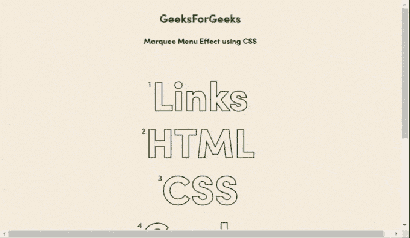

# CSS 标记插件

> 哎哎哎:# t0]https://www . geeksforgeeks . org/CSS-marqueemenu 插件/

在本文中，我们将学习如何使用 CSS**marquemenu**插件实现菜单的*字幕*效果。字幕是一种动画效果，用于开发网页，以获得一些有吸引力的文本或图像在垂直或水平方向滚动。

**注意:**请下载工作文件夹中的 CSS[**marquemenu**](https://github.com/codrops/CSSMarqueeMenu/)插件，并在你的 HTML 代码头部包含所需文件。

> <link href="”https://use.typekit.net/zhq0vyf.css”" rel="”stylesheet”" type="”text/css”/">
> <链接

**示例:**以下示例使用 HTML 控件和基于 CSS 的**marquemenu**插件演示了给定菜单的字幕效果。插件的“base.css”文件的“marquee”、“marquee _ _ inner”、“menu _ item-link”等不同类被附加到如下所示的 HTML 标记上，以获得预期的输出。

```html
<!DOCTYPE html>
<html lang="en" class="no-js">

<head>
    <meta charset="UTF-8" />
    <meta name="viewport" 
          content="width=device-width,
                   initial-scale=1">
    <title>CSS-only Marquee Menu Effect </title>
    <meta name="description" 
        content="A menu with a css-only marquee hover effect" />

    <link rel="stylesheet"
          href="https://use.typekit.net/zhq0vyf.css">
    <link rel="stylesheet"
          type="text/css" 
          href="css/base.css" />
    <style>
      body{
      text-align:center;
      }
    </style>
</head>

<body class="demo-1">
   <h2 style="color:green">GeeksForGeeks</h2>
   <b>Marquee Menu Effect using CSS</b>
    <main>        
        <nav class="menu">
            <div class="menu__item">
                <a class="menu__item-link">Links</a>
                
                <div class="marquee">
                    <div class="marquee__inner" 
                         aria-hidden="true">
                        <span>Hyperlinks</span>
                        <span>Hypertexts</span>
                        <span>Hypermedia</span>
                        <span>Graphics</span>
                    </div>
                </div>
            </div>
            <div class="menu__item">
                <a class="menu__item-link">HTML</a>
                
                <div class="marquee">
                    <div class="marquee__inner"
                         aria-hidden="true">
                        <span>Attributes</span>
                        <span>Paragraphs</span>
                        <span>Head</span>
                        <span>Tables</span>
                        <span>Lists</span>
                    </div>
                </div>
            </div>
            <div class="menu__item">
                <a class="menu__item-link">CSS</a>
                
                <div class="marquee">
                    <div class="marquee__inner"
                         aria-hidden="true">
                        <span>Inline styles</span>
                        <span>External CSS</span>
                        <span>Internal CSS</span>   
                   </div>
                </div>
            </div>
            <div class="menu__item">
                <a class="menu__item-link">Geeks</a>
                
                <div class="marquee">
                    <div class="marquee__inner" 
                         aria-hidden="true">
                        <span>PHP</span>
                        <span>jQuery</span>
                        <span>Algorithm</span>
                        <span>JavaScript</span>
                        <span>MySQL</span>
                    </div>
                </div>
            </div>
            <div class="menu__item">
                <a class="menu__item-link">GeeksWeek</a>
                
                <div class="marquee">
                    <div class="marquee__inner" 
                         aria-hidden="true">
                        <span>GeeksWeek</span>
                        <span>Contact</span>
                        <span>GeeksWeek</span>
                        <span>Contest</span>
                    </div>
                </div>
            </div>
        </nav>        
    </main>    
</body>
</html>
```

**输出:**
