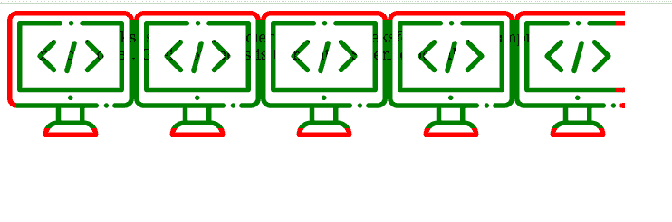
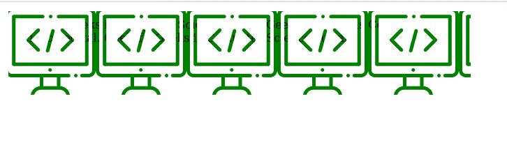

# CSS 遮罩剪辑属性

> 原文:[https://www.geeksforgeeks.org/css-mask-clip-property/](https://www.geeksforgeeks.org/css-mask-clip-property/)

**蒙版剪辑** CSS 属性指定受蒙版影响的区域。

**语法:**

```html
mask-clip: geometry-box values
/* Or */
mask-clip: Keyword values
/* Or */
mask-clip: Non-standard keyword values
/* Or */
mask-clip: Multiple values
/* Or */
mask-clip: Global values

```

**属性值:**该属性接受上面提到的和下面描述的值:

*   **几何框值:**该属性值是指用*内容框、填充框、边框框、边距框、填充框、描边框、视图框、*等单位定义的值。
*   **关键字值:**该属性值是指用无剪辑等单位定义的值
*   **非标准关键字值:**该属性值是指用边框、填充、内容、文本等单位定义的值。
*   **多个值:**该属性值是指用*填充框、无剪辑、视图框、填充框、边框框*等单位定义的值。
*   **全局值:**该属性值是指用*继承、初始、取消设置、*等单位定义的值

**示例 1:** 以下示例使用*边框*说明了**遮罩剪辑**属性:

```html
<!DOCTYPE html>
<html>

   <head>
      <style>

        .geeks{
              width:50%;
              height:100px;
              background:green;
              border:10px solid red;
              padding:10px;
              -webkit-mask-image:url(image.svg);
              mask-clip: border-box;
        }
        </style>
    </head>
<body>

    <div class="geeks" >
          GeeksforGeeks is Computer Science portal.
          GeeksforGeeks is Computer Science portal.
          GeeksforGeeks is Computer Science portal.
    </div>

</body>

</html>
```

**输出:**



**示例 2:** 以下示例使用*填充框*说明了**遮罩剪辑**属性:

```html
<!DOCTYPE html>
<html>
    <head>
       <style>
          .geeks{
                width:50%;
                height:100px;
                background:green;
                border: 5px solid red;
                padding:10px;
                -webkit-mask-image:url(image.svg);
                mask-clip: padding-box;
          }

        </style>
    </head>
<body>

      <div class="geeks" >
            GeeksforGeeks is Computer Science portal.
            GeeksforGeeks is Computer Science portal.
            GeeksforGeeks is Computer Science portal.
      </div>

</body>

</html>
```

**输出:**



**支持的浏览器:**

*   铬
*   边缘
*   歌剧
*   旅行队
*   互联网浏览器(不支持)。
*   火狐(部分支持)。