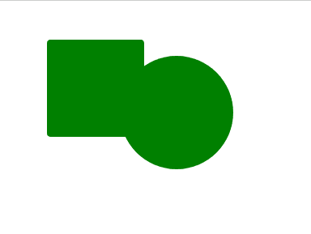
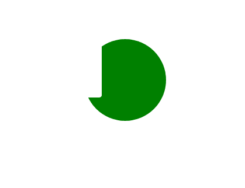

# CSS 遮罩-复合属性

> 原文:[https://www.geeksforgeeks.org/css-mask-composite-property/](https://www.geeksforgeeks.org/css-mask-composite-property/)

**遮罩复合**属性定义了多个复合操作来组合多个遮罩层。第一个网址层在所有层的顶部，最后一个网址层在底部。

**语法:**

```
mask-composite: Keyword values
/* Or */
mask-composite: Global values
```

**属性值:**该属性接受上面提到的和下面描述的值:

*   **关键字值:**该属性值是指用*加减、相交、排除、*等单位定义的值。
*   **全局值:**该属性值是指用*继承、初始、取消设置、*等单位定义的值

**示例 1:** 以下示例使用*添加*来说明**遮罩复合**属性:

```
<!DOCTYPE html>
<html>

    <head>
        <style>

        .geeks{
              width: 22%;
              height: 200px;
              background: green;
              -webkit-mask-image: 
                url("image.svg"), 
                url("image2.svg");
              -webkit-mask-size: 140px, 120px;
              -webkit-mask-position: 140px 60px, 50px;
              -webkit-mask-repeat: no-repeat;
              mask-composite: add;
        }

        </style>
    </head>
<body>

    <div class="geeks"></div>

</body>
</html>
```

**输出:**



**示例 2:** 以下示例使用*减去*来说明**遮罩复合**属性:

```
<!DOCTYPE html>
<html>

    <head>
        <style>

        .geeks{
              width: 22%;
              height: 200px;
              background: green;
              -webkit-mask-image: 
                url("image.svg"), 
                url("image2.svg");
              -webkit-mask-size: 140px, 120px;
              -webkit-mask-position: 140px 60px, 50px;
              -webkit-mask-repeat: no-repeat;
              mask-composite: subtract;
        }

        </style>
    </head>
<body>

    <div class="geeks"></div>

</body>
</html>
```

**输出:**



**支持的浏览器:**

*   火狐浏览器
*   Chrome(不支持)
*   歌剧(不支持)
*   Safari(不支持)
*   边缘(不支持)
*   互联网浏览器(不支持)