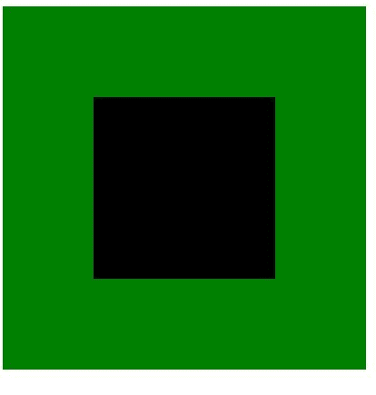
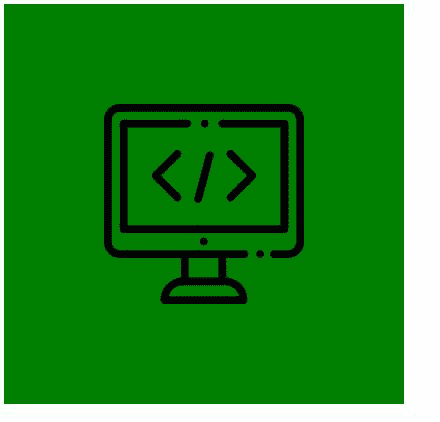

# CSS 遮罩-图像属性

> 原文:[https://www.geeksforgeeks.org/css-mask-image-property/](https://www.geeksforgeeks.org/css-mask-image-property/)

CSS 中的**蒙版-图像**属性用于设置图像或文本的蒙版。它用于为 CSS 中的特定元素形成一个遮罩层。

**语法:**

```css
mask-image: none | <mask-source>
```

*   **无:**未设置掩膜层，设置透明黑色层。

**语法:**

```css
mask-image: none
```

**示例:**

在本例中，没有创建遮罩。

## 超文本标记语言

```css
<!DOCTYPE html>
<html lang="en">
    <head>
        <meta charset="UTF-8" />
        <meta name="viewport"
              content="width=device-width,
                       initial-scale=1.0" />
        <title>Document</title>
    </head>
    <style>
        .container{
          background-color: green;
          background-repeat: no-repeat;
          width: 400px;
          height: 400px;
          display: flex;
          align-items: center;
          justify-content: center;
        }
        .mask{
          background:black;
          width: 200px;
          height: 200px;
          -webkit-mask-image: none;
        }
        .mask h1{
          height: 400px;
          width: 400px;
        }
        wrap text h1
    </style>
    <body>
        <div class="container">
            <div class="mask"></div>
        </div>
    </body>
</html>
```

**输出:**



**<蒙版-来源> :** 用于给出图片的来源 url。

**语法:**

```css
mask-image: url();
```

**示例:**

图标是黑色背景色上的遮罩。可以根据需要进行更改。

## 超文本标记语言

```css
<!DOCTYPE html>
<html lang="en">
    <head>
        <meta charset="UTF-8" />
        <meta name="viewport"
              content="width=device-width,
                       initial-scale=1.0" />
        <title>Document</title>
    </head>
    <style>
        .container{
          background-color: green;
          background-repeat: no-repeat;
          width: 400px;
          height: 400px;
          display: flex;
          align-items: center;
          justify-content: center;
        }
        .mask{
          background:black;
          width: 200px;
          height: 200px;
          -webkit-mask-image: url(
"https://image.flaticon.com/icons/svg/942/942195.svg");
        }
        .mask h1{
          height: 400px;
          width: 400px;
        }
        wrap text h1
    </style>
    <body>
        <div class="container">
            <div class="mask"></div>
        </div>
    </body>
</html>
```

**输出:**



**支持的浏览器:**

*   铬
*   边缘
*   火狐浏览器
*   歌剧
*   旅行队