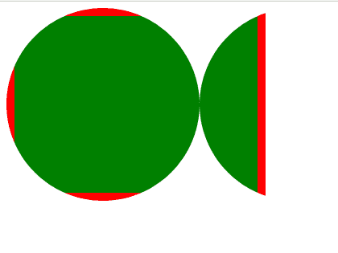
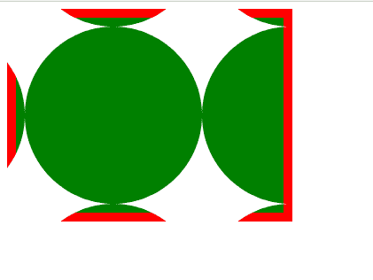

# CSS 遮罩原点属性

> 原文:[https://www.geeksforgeeks.org/css-mask-origin-property/](https://www.geeksforgeeks.org/css-mask-origin-property/)

**遮罩原点**属性设置遮罩图像相对于长方体模型不同组件的位置。

**语法:**

```html
mask-origin: Keyword values
/* Or */
mask-origin: Multiple values
/* Or */
mask-origin: Non-standard keyword values
/* Or */
mask-origin: Global values
```

**属性值:**该属性接受上面提到的和下面描述的值:

*   **关键字值:**该属性值是指用*内容框、填充框、边距框、*边框、*填充框、描边框、视图框、*等单位定义的值。
*   **非标准关键字值:**该属性值是指用填充、*边框、内容等单位定义的值。*
*   **多个值:**该属性值是指用*填充框、填充框、*视图框、*边框*、*等单位定义的值。*
*   **全局值:**该属性值是指用*继承、取消设置、*初始、*等*等单位定义的值

**示例 1:** 以下是使用*边框框*T6:说明**遮罩来源**属性的示例

```html
<!DOCTYPE html>
<html>

    <head>
        <style>

        .geeks{
              width: 22%;
              height: 200px;
              background: green;
              border: 10px solid red;
              padding: 10px;
              color:white;
              -webkit-mask-image: 
              url("image.svg");
              -webkit-mask-repeat:repeat;
              mask-origin: border-box;        
        }

        </style>
    </head>
<body>

    <div class="geeks"></div>

</body>

</html>
```

**输出:**



**示例 2:** 以下是使用*内容框*说明**遮罩来源**属性的示例:

```html
<!DOCTYPE html>
<html>

    <head>
        <style>

        .geeks{
              width: 22%;
              height: 200px;
              background: green;
              border: 10px solid red;
              padding: 10px;
              color:white;
              -webkit-mask-image: 
              url("image.svg");
              -webkit-mask-repeat:repeat;
              mask-origin: content-box;        
        }

        </style>
    </head>
<body>

    <div class="geeks"></div>

</body>

</html>
```

**输出:**



**支持的浏览器:**

*   铬
*   火狐浏览器
*   旅行队
*   边缘
*   歌剧
*   互联网浏览器(不支持)。