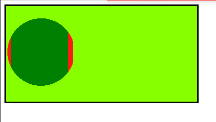

# CSS 遮罩位置属性

> 原文:[https://www.geeksforgeeks.org/css-mask-position-property/](https://www.geeksforgeeks.org/css-mask-position-property/)

**遮罩位置**属性通过使用百分比或关键字值来设置遮罩定位区域内的遮罩图像。**遮罩位置**总是有两个值(水平偏移和垂直偏移)。如果只指定了一个值，则另一个值被假定为 50%或居中。

**语法:**

```
mask-position: Keyword values
/* Or */
mask-position: position values
/* Or */
mask-position: Multiple values
/* Or */
mask-position: Global values
```

**属性值:**该属性接受上面提到的和下面描述的值:

*   **关键字值:**该属性值是指用*顶部、底部、左侧、右侧、中间、*等单位定义的值。
*   **位置值:**该属性值是指用 x% y%等单位定义的值，其中 x 和 y 是某个整数。
*   **多个值**:该属性值是指用*右上角*、 *2rem 2rem、center、*等单位定义的值。
*   **全局值:**该属性值是指用*继承、初始、取消设置、*等单位定义的值。

**示例 1:** 以下示例使用位置值说明了**遮罩位置**属性

```
<!DOCTYPE html>
<html>

    <head>
        <style>

        .Container{
            border: 3px solid black;
            background-color: rgb(136, 255, 0);
            width: 30%;
            height: 30vh;
        }

        .geeks{
              width: 30%;
              height:200px;
              background: green;
              border: 10px solid red;
              -webkit-mask-image: 
              url("image.svg");
              -webkit-mask-repeat: no-repeat;
              mask-position: 0.2rem 30%;
        }

        </style>
    </head>
<body>

    <div class="Container">
        <div class="geeks"></div>
    </div>

</body>

</html>
```

**输出:**



**示例 2:** 以下示例使用关键字值说明了**遮罩位置**属性

```
<!DOCTYPE html>
<html>

    <head>
        <style>

        .Container{
            border: 3px solid black;
            background-color: rgb(136, 255, 0);
            width: 30%;
            height: 30vh;
        }

        .geeks{
              width: 30%;
              height:200px;
              background: green;
              border: 10px solid red;
              -webkit-mask-image: 
              url("image.svg");
              -webkit-mask-repeat: no-repeat;
              mask-position: top;
        }

        </style>
    </head>
<body>

    <div class="Container">
        <div class="geeks"></div>
    </div>

</body>

</html>
```

**输出:**


**支持的浏览器:**

*   铬合金。
*   狩猎。
*   边缘。
*   火狐。
*   歌剧。
*   互联网浏览器(不支持)。