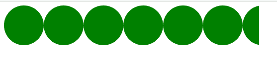
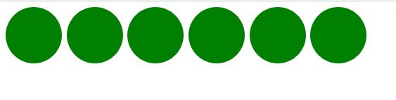

# CSS 遮罩-重复属性

> 原文:[https://www.geeksforgeeks.org/css-mask-repeat-property/](https://www.geeksforgeeks.org/css-mask-repeat-property/)

CSS **遮罩-重复**设置遮罩图像在调整大小和位置后的放置方式。掩模图像可以沿垂直或水平或两个轴重复，也可以不重复。

**语法:**

```css
mask-repeat: One-values
/* Or */
mask-repeat: Two-values
/* Or */
mask-repeat: Multiple values
/* Or */
mask-repeat: Global values
```

**属性值:**该属性接受上面提到的和下面描述的值:

*   **一值:**该属性值是指用*空格、圆形、重复、重复-x、重复-y、不重复*等单位定义的值。
*   **双值:**该属性值是指用*重复空间、圆形空间、重复重复、*等单位定义的值。
*   **多个值:**该属性值是指用*空间圆、不重复、*等单位定义的值。
*   **全局值:**该属性值是指用*继承、初始、取消设置、*等单位定义的值。

**示例 1:** 以下示例使用*单值:*说明了**遮罩-重复**属性

```css
<!DOCTYPE html>
<html>

    <head>
        <style>

            .geeks{
                width: 40%;
                height:80px;
                background: green;
                -webkit-mask-image: 
                url("image.svg");
                mask-repeat: repeat-x;        
            }

        </style>
    </head>

<body>

    <div class="geeks"></div>

</body>

</html>
```

**输出:**



**示例 2:** 以下示例使用*双值:*说明了**遮罩-重复**属性

```css
<!DOCTYPE html>
<html>

    <head>
        <style>

            .geeks{
                width: 40%;
                height:80px;
                background: green;
                -webkit-mask-image: 
                url("image.svg");
                mask-repeat: space repeat;        
            }

        </style>
    </head>
<body>

    <div class="geeks"></div>

</body>

</html>
```

**输出:**



**支持的浏览器:**

*   铬
*   火狐浏览器
*   旅行队
*   歌剧
*   边缘
*   互联网浏览器(不支持)。