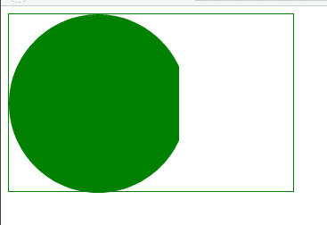
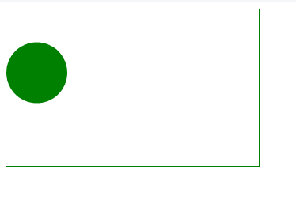

# CSS 掩码大小属性

> 原文:[https://www.geeksforgeeks.org/css-mask-size-property/](https://www.geeksforgeeks.org/css-mask-size-property/)

CSS **蒙版大小**属性设置蒙版绘画区域上蒙版图像的大小。

**语法:**

```css
mask-size: Keyword values
/* Or */
mask-size: One-values
/* Or */
mask-size: Two-values
/* Or */
mask-size: Multiple-values
/* Or */
mask-size: Global values

```

**属性值:**该属性接受上面提到的和下面描述的值:

*   **关键字值:**该属性值是指用覆盖、包含等单位定义的值。
*   **单值:**该属性值是指用 *%、em、px 等*等单位定义的值。高度设置为自动。它的基本语法是*蒙版大小:图像的宽度；*
*   **双值:**该属性值是指用% em、px 等单位定义的值。高度设置为自动。其基本语法是*蒙版大小:图像的宽度图像的高度；*
*   **多个值:**该属性值是指用 *%、px、em、auto、*等单位定义的值。
*   **全局值:**该属性值是指用*继承、初始、取消设置、*等单位定义的值。

**示例 1:** 以下示例使用单值说明了**遮罩大小**属性

```css
<!DOCTYPE html>
<html>

    <head>
        <style>
            .Container{
                width:25%;
                height:200px;
                box-sizing:border-box;
                border:1px solid green;    
            }
            .geeks{
                width: 60%;
                height:200px;
                background: green;
                -webkit-mask-image: 
                url("image.svg");
                -webkit-mask-repeat:no-repeat;
                mask-size: cover;            
            }

        </style>
    </head>
<body>

    <div class="Container">
        <div class="geeks"></div>
    </div>

</body>

</html>
```

**输出:**



**示例 2:** 以下示例使用双值说明了**遮罩大小**属性

```css
<!DOCTYPE html>
<html>

    <head>
        <style>
            .Container{
                width:25%;
                height:200px;
                box-sizing:border-box;
                border:1px solid green;    
            }
            .geeks{
                width: 60%;
                height:200px;
                background: green;
                -webkit-mask-image: 
                url("image.svg");
                -webkit-mask-repeat:no-repeat;
                mask-size: 40% 80%;            
            }

        </style>
    </head>
<body>

    <div class="Container">
        <div class="geeks"></div>
    </div>

</body>

</html>
```

**输出:**



**支持的浏览器:**

*   铬
*   火狐浏览器
*   旅行队
*   歌剧
*   边缘
*   互联网浏览器(不支持)