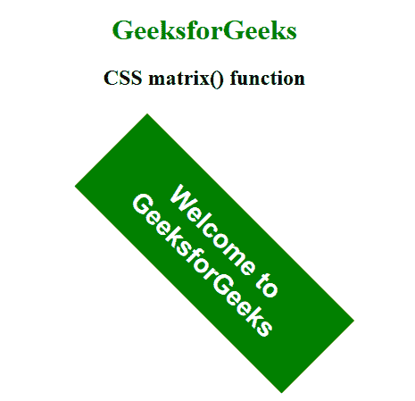

# CSS |矩阵()函数

> 原文:[https://www.geeksforgeeks.org/css-matrix-function/](https://www.geeksforgeeks.org/css-matrix-function/)

**矩阵()函数**是一个内置函数，用于创建齐次 2D 变换矩阵。

**语法:**

```html
matrix( a, b, c, d, tx, ty )
```

**参数:**该功能接受六个参数，如上所述，描述如下:

*   **a、b、c、d:** 这些参数用来描述线性变换。
*   **tx:** 此参数用于描述 x 轴上的线性平移。
*   **ty:** 此参数用于描述 y 轴上的线性平移。

下面的例子说明了**矩阵()函数**在 CSS 中:
**例子:**

```html
<!DOCTYPE html>
<html>

<head>
    <title>
      CSS matrix() function
  </title>
    <style>
        body {
            text-align: center;
        }

        h1 {
            color: green;
        }

        .GFG {
            transform-origin: 0 0;
            transform: matrix(0.8, 0.8, -0.8, 0.8, 250, -30);
            font-size: 26px;
            font-weight: bold;
            width: 250px;
            padding: 20px;
            background: green;
            color: white;
            font-family: sans-serif;
        }
    </style>
</head>

<body>
    <h1>GeeksforGeeks</h1>
    <h2>CSS matrix() function</h2>
    <br>
    <br>

    <div class="GFG">
      Welcome to GeeksforGeeks
  </div>
</body>

</html>
```

**输出:**


**支持的浏览器:****矩阵()功能**支持的浏览器如下:

*   谷歌 Chrome
*   微软公司出品的 web 浏览器
*   火狐浏览器
*   旅行队
*   歌剧