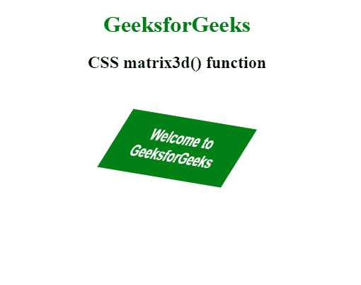

# CSS | matrix3d()函数

> 原文:[https://www.geeksforgeeks.org/css-matrix3d-function/](https://www.geeksforgeeks.org/css-matrix3d-function/)

**matrix3d()函数**是一个内置函数，用于应用一个变换来创建一个 4×4 齐次矩阵的 3d 变换。

**语法:**

```html
matrix3d( a1, b1, c1, d1, a2, b2, c2, d2, a3, b3, c3, d3, a4, b4, c4, d4 )
```

**参数:**该功能接受 16 个参数，如上所述，描述如下:

*   **a1、b1、c1、d1、a2、b2、c2、d2、a3、b3、c3、d3、d4:** 这些参数用于保存线性变换的值。
*   **a4、b4、c4:** 这些参数用来保存平移的值。

以下示例说明了 CSS 中的 matrix3d()函数:
**示例:**

```html
<!DOCTYPE html> 
<html> 
<head> 
    <title>
        CSS matrix3d() function
        </title> 

    <style> 
        .GFG { 
            transform: matrix3d(
                0.6, 0.1, 0.7, 0,
                -0.5, 0.8, 0.1, 0,
                -0.6, -0.5, 0.5, 0,
                0, 0, 0, 1
            );

            font-size:26px;
            font-weight:bold;
            width:250px;
            padding:20px;
            background: green;
            color: white;
            font-family: sans-serif;
        } 
    </style> 

</head> 

<body> 
    <center>
        <h1 style="color:green">GeeksforGeeks</h1> 
        <h2>CSS matrix3d() function</h2> 
        <br><br> 

        <div class="GFG">
            Welcome to GeeksforGeeks
        </div> 
    </center>
</body> 

</html>                    
```

**输出:**


**支持的浏览器:****matrix 3d()功能**支持的浏览器如下:

*   谷歌 Chrome
*   微软公司出品的 web 浏览器
*   火狐浏览器
*   旅行队
*   歌剧