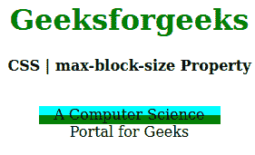
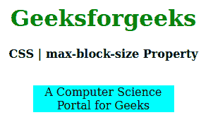

# CSS |最大块大小属性

> 原文:[https://www.geeksforgeeks.org/css-max-block-size-property/](https://www.geeksforgeeks.org/css-max-block-size-property/)

**CSS 最大块大小属性**用于在与写入方向相反的方向上创建元素的最大大小。比如如果书写方向是水平的，那么**最大块尺寸**相当于**T5 最大高度 T7，如果是垂直模式，那么等于**T9 最大宽度。****

**语法:**

```
max-block-size: length | percentage | auto | none | min-content | 
                max-content | fit-content | inherit | initial | unset;
```

**属性值:**

*   **长度:**设置 px、cm、pt 等定义的固定值。允许负值。它的默认值是 0px。
*   **百分比(%):** 与长度相同，但大小是根据窗口大小的百分比设置的。
*   **自动:**当希望浏览器确定块大小时使用。
*   **无:**不想限制盒子大小时使用。
*   **最大内容:**当你喜欢盒子大小的最大宽度时使用。
*   **最小内容:**当你喜欢盒子大小的最小宽度时使用。
*   **适合-内容:**当你喜欢盒子大小的精确宽度时使用。
*   **初始值:**用于将最大块大小属性的值设置为默认值。
*   **inherit:** 当希望元素继承其父元素的最大块大小属性作为自己的属性时使用。
*   **取消设置:**用于取消设置默认最大块大小。

以下示例说明了 CSS 中的**最大块大小属性**:

**例 1:**

```
<!DOCTYPE html> 
<html> 

<head> 
    <title>CSS | max-block-size Property</title> 
    <style> 
        h1 { 
            color: green; 
        } 

        div { 
            background-color: green; 
            width: 200px; 
            height: 20px; 
        } 

        .one { 
            position: relative; 
            max-block-size: 10px; 
            background-color: cyan; 
        } 
    </style> 
</head> 

<body> 
    <center> 
        <h1>Geeksforgeeks</h1> 
        <b>CSS | max-block-size Property</b> 
        <br> 
        <br> 
        <div> 
            <p class="one"> 
                A Computer Science Portal for Geeks 
            </p> 
        </div> 
    </center> 
</body> 

</html>                     
```

**输出:**


**例 2:**

```
<!DOCTYPE html> 
<html> 

<head> 
    <title>CSS | max-block-size Property</title> 
    <style> 
        h1 { 
            color: green; 
        } 

        div { 
            background-color: green; 
            width: 200px; 
            height: 20px; 
        } 

        .one { 
            position: relative; 
            max-block-size: auto; 
            background-color: cyan; 
        } 
    </style> 
</head> 

<body> 
    <center> 
        <h1>Geeksforgeeks</h1> 
        <b>CSS | max-block-size Property</b> 
        <br> 
        <br> 
        <div> 
            <p class="one"> 
                A Computer Science Portal for Geeks 
            </p> 
        </div> 
    </center> 
</body> 

</html>                     
```

**输出:**


**支持的浏览器:****最大块大小属性**支持的浏览器如下:

*   火狐浏览器
*   谷歌 Chrome
*   边缘
*   歌剧

**参考:**[https://developer . Mozilla . org/en-US/docs/Web/CSS/max-block-size](https://developer.mozilla.org/en-US/docs/Web/CSS/max-block-size)