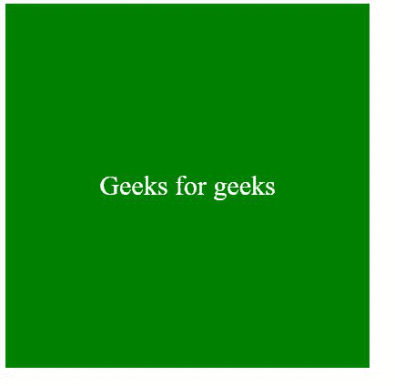
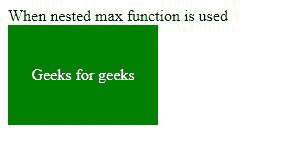

# CSS max()函数

> 原文:[https://www.geeksforgeeks.org/css-max-function/](https://www.geeksforgeeks.org/css-max-function/)

CSS 中的 **max()** 功能用于设置给定数字的最大值。它用于从一组逗号分隔的值中返回最大值。它可以接受长度、频率、整数、角度和时间类型的值。

**语法:**

```html
max(value1, value2...);
```

**参数:**取任意数量的参数。

*   **值:**是一组逗号分隔的值，从中选择最大的一个。

**返回值:**这个函数从一组逗号分隔的值中返回最大的值。

**示例 1:** 本示例演示了仅给出 2 个参数时的上述功能。

## 超文本标记语言

```html
<!DOCTYPE html>
<html lang="en">

<head>
    <meta charset="UTF-8">
    <meta name="viewport" content=
        "width=device-width, initial-scale=1.0">

    <style>
        .container {
            display: flex;
            justify-content: center;
            align-content: center;
            color: white;
            font-size: 30px;
            background-color: green;
            width: max(100px, 400px);
            height: max(100px, 400px);
        }

        p {
            align-self: center;
        }
    </style>
</head>

<body>
    <div class="container">
        <p>Geeks for geeks</p>
    </div>
</body>

</html>
```

**输出:**



**例 2:**max()函数给出两个以上参数时。

## 超文本标记语言

```html
<!DOCTYPE html>
<html lang="en">

<head>
    <meta charset="UTF-8">
    <meta name="viewport" content=
        "width=device-width, initial-scale=1.0">

    <style>
        .container {
            display: flex;
            justify-content: center;
            align-content: center;
            color: white;
            font-size: auto;
            background-color: green;
            width: max(10px, max(max(10px, 40px), 
                        max(10px, 150px)));

            height: max(10px, max(max(10px, 40px),
                        max(10px, 100px)));
        }

        p {
            align-self: center;
        }
    </style>
</head>

<body>
    When nested max function is used
    <div class="container">
        <p>Geeks for geeks</p>
    </div>
</body>

</html>
```

**输出:**



**支持的浏览器:**

*   铬
*   边缘
*   火狐浏览器
*   歌剧
*   旅行队