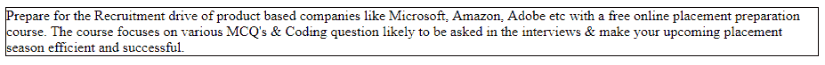
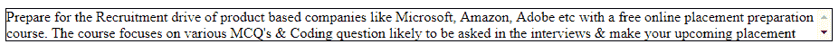

# CSS |最大高度属性

> 原文:[https://www.geeksforgeeks.org/css-max-height-property/](https://www.geeksforgeeks.org/css-max-height-property/)

CSS 中的最大高度属性用于设置元素的最大高度。如果元素的内容大于指定的最大高度，则内容将溢出，否则没有效果。如果元素的含量较小，那么它就没有影响。高度属性值可以被最大高度属性覆盖。

**语法:**

```html
max-height: none|length|initial|inherit; 
```

**属性值:**

*   **none:** It is the default value and does not contain max-height. It is synonymous to no maximum height specification.

    **语法:**

    ```html
    max-height: none;
    ```

    **示例:**

    ```html
    <!DOCTYPE html>
    <html>
        <head>
            <title>max-height property</title>

            <style>
                p {
                    max-height:none;
                    border:1px solid black;
                    overflow:auto;
                }
            </style>
        </head>

        <body>
            <p>
                Prepare for the Recruitment drive of
                product based companies like Microsoft, 
                Amazon, Adobe etc with a free online 
                placement preparation course. The course
                focuses on various MCQ's & Coding question
                likely to be asked in the interviews & make
                your upcoming placement season efficient
                and successful.
            </p>
        </body>
    </html>
    ```

    **输出:**
    

*   **length:** This property is used to define the max-height in length. The length can be set using px, em etc.

    **语法:**

    ```html
    max-height: length;
    ```

    **示例:**

    ```html
    <!DOCTYPE html>
    <html>
        <head>
            <title>max-height property</title>

            <style>
                p {
                    max-height:35px;
                    border:1px solid black;
                    overflow:auto;
                }
            </style>
        </head>

        <body>
            <p>
                Prepare for the Recruitment drive of
                product based companies like Microsoft, 
                Amazon, Adobe etc with a free online 
                placement preparation course. The course
                focuses on various MCQ's & Coding question
                likely to be asked in the interviews & make
                your upcoming placement season efficient
                and successful.
            </p>
        </body>
    </html>
    ```

    **输出:**
    

*   **initial:** This property is used to set the value of the max_height to its default value.

    **语法:**

    ```html
    max-height: initial;
    ```

    **示例:**

    ```html
    <!DOCTYPE html>
    <html>
        <head>
            <title>max-height property</title>

            <style>
                p {
                    max-height:initial;
                    border:1px solid black;
                    overflow:auto;
                }
            </style>
        </head>

        <body>
            <p>
                Prepare for the Recruitment drive of
                product based companies like Microsoft, 
                Amazon, Adobe etc with a free online 
                placement preparation course. The course
                focuses on various MCQ's & Coding question
                likely to be asked in the interviews & make
                your upcoming placement season efficient
                and successful.
            </p>
        </body>
    </html>
    ```

    **输出:**
    

*   **inherit:** 此属性从其父级继承。

**支持的浏览器:**最大高度属性支持的浏览器如下:

*   谷歌 Chrome 1.0
*   Internet Explorer 7.0
*   Firefox 1.0
*   Opera 7.0
*   Safari 2.0.2